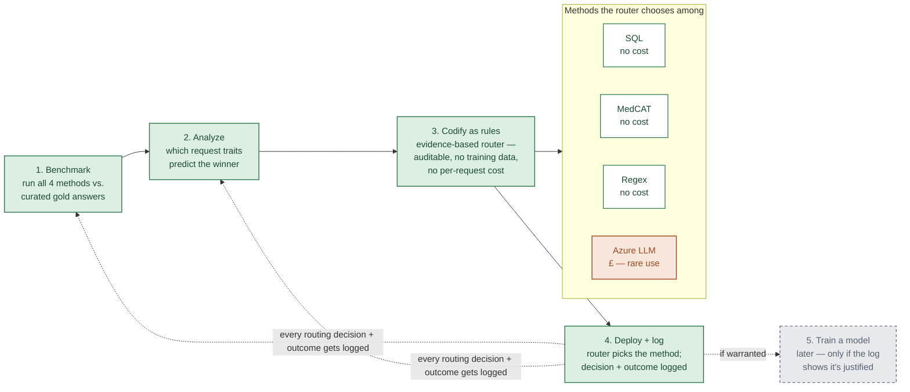

# From benchmark to router: how we pick the best method per request

*Plan rationale — request-routing*

We don't yet know whether CogStack's methods beat plain SQL, or by how much, for the kinds of requests this team actually gets. This is the plan for finding out — and for turning that answer into something that guides every future request, without assuming a trained model is required to do it.

## Roadmap

1. **Benchmark** *(now)* — run all 4 methods vs. curated gold answers
2. **Analyze** *(now)* — which request traits predict the winner
3. **Codify as rules** *(now)* — evidence-based router: auditable, no training data, no per-request cost
4. **Deploy + log** *(now)* — router picks the method; decision + outcome logged
5. **Train a model** *(later, if warranted)* — only if the log shows it's justified

Every routing decision + outcome feeds back into the log (stage 4 → stages 1–2), which is what would eventually justify stage 5.

Stage 3 is the actual deliverable: a router built from evidence, not guesswork, that costs nothing to run because choosing among methods is free — only running Azure carries a real cost, which is why the router's job is to keep that path rare. Stage 5 is deliberately kept separate: it's a live option, not a commitment.

**Legend:** green solid = what we'd build now · grey dashed = deferred, revisit if the log justifies it · orange = carries a real, metered cost

## The five stages

1. **Benchmark** `now`
   Run SQL, MedCAT concept search, and regex against every historical request we have a curated gold answer for. Run Azure LLM on a sampled subset only, since it's the one method with a real per-call cost. Score each method against the gold answer, not against each other.

2. **Analyze** `now`
   Look for what distinguishes the requests where CogStack's methods won from the ones where SQL was already good enough — e.g. does it name a specific concept, does it need negation handling, does it need reasoning about timing across documents. This is where "is it worth switching off SQL" actually gets answered, request-type by request-type.

3. **Codify as rules** `now`
   Turn those patterns into an explicit, written decision table: which method to use for which kind of request, backed by the benchmark numbers. This is "the classifier" in practice — it doesn't need to be a trained statistical model to do the job, and a rule table is something anyone on the team can read, question, and correct.

4. **Deploy + log** `now`
   Wire the rule table into how requests actually get handled, and log every decision plus whether it turned out right. That log is what would eventually justify a trained model — it's the evidence, not a formality.

5. **Train a model** `later, if needed`
   Only worth doing once the log shows the rule table is running out of road — too many requests it can't confidently place, or enough volume that a model would clearly generalize better. Not a starting assumption.

## Why rules before a trained model

With roughly 150 historical requests spread across a handful of categories, there isn't enough data for a trained text classifier to reliably beat a well-evidenced rule table — and the rule table is auditable in a way a model isn't, which matters when the downstream decision affects a cancer data request.

## Why the Azure cost doesn't block this

The router's own decision — which method to use — costs nothing to compute, whether it's rules or eventually a small local model. The Azure cost only applies to the rare request the router actually sends to the LLM, which is precisely what a good router is supposed to minimize, not avoid engaging with.
