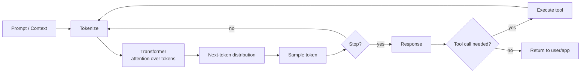
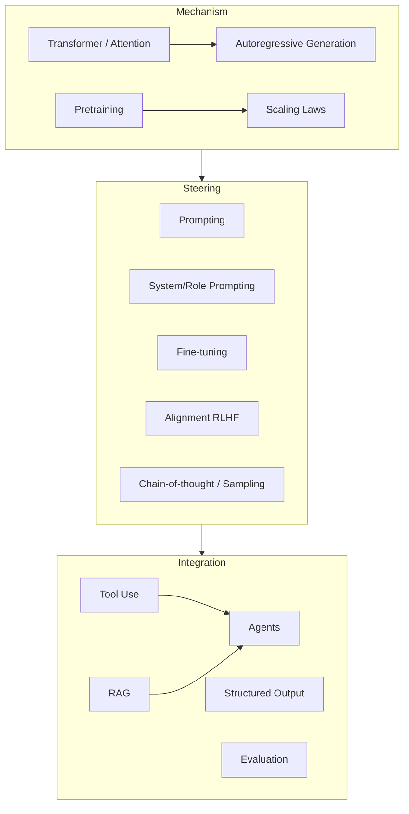
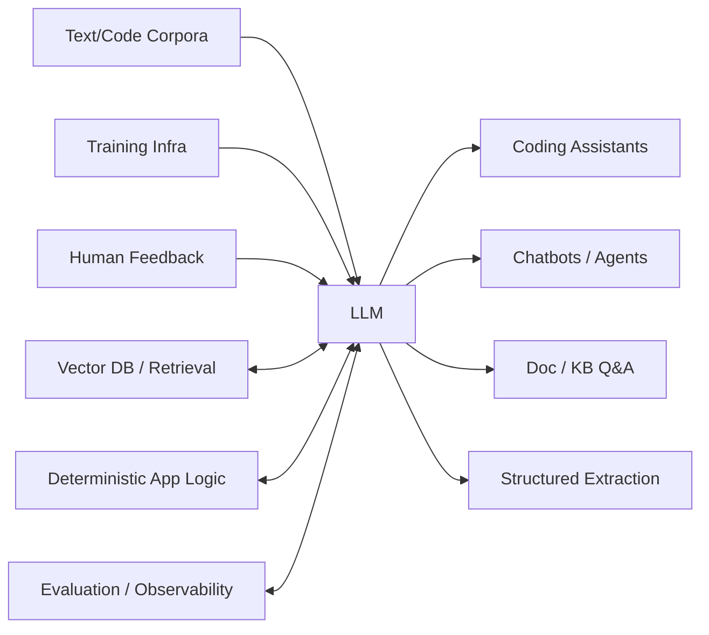

# Learning Map: Large Language Models (LLMs)

## 1. Essence

**What is it fundamentally?**
An LLM is a single, very large neural network trained on one deceptively simple objective — predict the next token given everything before it — at a scale (data, parameters, compute) large enough that the network is forced to internalize grammar, facts, reasoning patterns, and task structure as side effects of getting that prediction right. It's a general-purpose sequence model, not a task-specific one.

**Why does it exist?**
Building a separate model for every language task (translation, summarization, classification, coding, Q&A) requires labeled data and engineering per task. LLMs exist because scaling one generic model on raw, unlabeled text turned out to produce a system that could do most of those tasks *without* task-specific training — just by being asked in natural language.

**What problem does it solve?**
The cost of specialization. Before LLMs, adapting a model to a new task meant collecting labels, engineering features, and retraining. LLMs shift that cost from "build a new system" to "write a better instruction" — collapsing the time and data needed to stand up a new capability from months to minutes.

**What did people do before it?**
- Pipeline NLP: separate models per task (POS tagger → parser → NER → classifier), each needing its own labeled data.
- Fine-tuned pretrained models (BERT-era): one pretrained base, but still one fine-tuned copy per task.
- Rule-based / templated systems for anything that needed to feel "intelligent" (chatbots, form-fillers).
- Human labor for anything requiring judgment, synthesis, or open-ended writing.

**What new possibilities does it create?**
- Natural language as a programming interface — the "prompt" becomes the API.
- Zero/few-shot task-switching: one deployed model handles arbitrary new tasks by instruction alone.
- Agents: LLMs that plan, call tools, observe results, and iterate — not just answer.
- Emergent capabilities that weren't explicitly trained for (multi-step reasoning, code synthesis, cross-lingual transfer) appearing simply from scale.

---

## 2. World Model

**Objects**
- **Tokens** — subword units; the atomic currency of everything an LLM reads or writes.
- **Context window** — the finite buffer of tokens (prompt + history + output) the model can attend to at once.
- **Weights / parameters** — the trained network; fixed at inference time unless explicitly fine-tuned.
- **Prompt** — the input that steers behavior without changing weights.
- **Completion / generation** — the model's output, produced one token at a time.
- **Embeddings** — vector representations, used both internally and externally (retrieval, similarity).
- **Tools / functions** — external capabilities (search, code execution, APIs) the model can invoke mid-generation.
- **System / developer / user roles** — layered instruction channels that set priority when instructions conflict.

**Actors**
- **Model providers** — train and serve the base model (Anthropic, OpenAI, open-weight communities, etc.).
- **Application builders** — wrap the model with prompts, tools, and orchestration to build a product.
- **End users** — interact via natural language, often unaware of the machinery underneath.
- **The model itself** — increasingly an actor in agentic settings: it decides what tool to call next, not just what text to emit.

**State changes**
Prompt text → tokenized → embedded → passed through transformer layers with attention → next-token probability distribution → sampled token → appended to context → loop until stop condition. In agentic use: model output → tool call → tool result appended to context → model continues reasoning.

**Workflows**
1. Pretrain a base model on massive general text (next-token prediction).
2. Align it (instruction-tuning, RLHF/RLAIF) so it follows instructions and refuses harmful requests.
3. Deploy behind an API/interface.
4. Application layer designs prompts (and optionally fine-tunes, or retrieves context, or wires tools).
5. Model generates a response, optionally calling tools and iterating (agent loop).
6. Output is evaluated, monitored, and the prompt/pipeline is refined based on failures.

**Systems**
- Training infrastructure (massive-scale distributed compute) — mostly opaque to application builders.
- Inference serving (the API you actually touch).
- Orchestration layers (prompt templates, RAG pipelines, agent frameworks, tool routers).
- Evaluation/monitoring harnesses (does the output meet the task's bar, is it safe, is it consistent).

**Value**
Value appears wherever a task can be described in language faster than it can be hand-coded: drafting, summarizing, coding assistance, research synthesis, customer-facing agents, structured extraction from messy text, and increasingly, autonomous multi-step task execution.

---

## 3. Concept Map

Three conceptual layers: **Mechanism**, **Steering**, **Integration**.

### Layer 1 — Mechanism (how the model works)
| Entity | Action | Purpose | Relationships |
|---|---|---|---|
| Transformer / self-attention | Weighs every token against every other token | Lets the model use long-range context, not just nearby words | Architectural backbone of all modern LLMs |
| Autoregressive generation | Predicts one token at a time, conditioned on all prior tokens | Turns "understanding" into a generation process | Explains why LLMs can't "revise" earlier tokens mid-generation without re-reading |
| Context window | Finite token budget for input + output | Bounds how much the model can "see" at once | Drives need for retrieval/summarization when data exceeds it |
| Pretraining objective (next-token prediction) | Learns statistical structure of language at scale | Produces a general-purpose base model | Everything else (alignment, prompting) builds on this |
| Scaling laws | Predictable loss improvement as data/params/compute grow | Justifies why "bigger" reliably helps, within limits | Explains emergent capabilities and diminishing returns |

### Layer 2 — Steering (how you control behavior without retraining)
| Entity | Action | Purpose | Relationships |
|---|---|---|---|
| Prompting (zero/few-shot) | Gives instructions/examples in-context | Adapts behavior instantly, no training | Cheapest, most flexible lever; ceiling bounded by context window |
| System/role prompting | Sets persistent behavioral constraints | Separates "how to behave" from "what the user asked" | Highest-priority instruction channel in most deployments |
| Fine-tuning | Updates weights on task-specific data | Bakes behavior in permanently, no per-call instruction needed | Higher cost/rigidity vs. prompting; used when prompting can't reach required consistency |
| Alignment (RLHF/RLAIF, instruction-tuning) | Trains the base model to follow instructions and avoid harm | Turns a raw predictor into a usable assistant | Distinct from task fine-tuning — this is provider-level, not app-level |
| Sampling parameters (temperature, top-p) | Controls randomness of token selection | Trades determinism for creativity/diversity | Orthogonal to prompting — same prompt, different outputs |
| Decoding/agentic loops (chain-of-thought, tool use) | Lets the model reason in steps or act before answering | Improves accuracy on multi-step or knowledge-grounded tasks | Bridges steering and integration layers |

### Layer 3 — Integration (how LLMs plug into systems)
| Entity | Action | Purpose | Relationships |
|---|---|---|---|
| Retrieval-Augmented Generation (RAG) | Injects retrieved external documents into context | Grounds answers in facts outside training data / keeps them current | Solves the "stale knowledge" and hallucination-on-facts problem |
| Tool use / function calling | Model emits structured calls to external systems | Extends capability beyond text generation (math, search, code exec, DB writes) | Foundation of agentic systems |
| Agents | Model plans, acts, observes, repeats toward a goal | Automates multi-step tasks, not single Q&A turns | Composition of prompting + tools + memory/state |
| Structured output (JSON schema, function args) | Constrains generation format | Makes LLM output machine-consumable/pipeline-safe | Necessary wherever an LLM's output feeds another system, not a human |
| Evaluation harnesses | Score outputs against task-specific criteria | Makes "is this good enough" measurable, not vibes-based | Required before trusting any prompting/fine-tuning change |

---

## 4. Decision Map

| Situation | Decision | Reason | Expected Outcome |
|---|---|---|---|
| Task is novel, low-volume, or requirements shift often | Prompt an LLM (zero/few-shot) | No training cycle; instructions change instantly | Fast iteration, higher per-call cost, some output variance |
| Task is narrow, high-volume, and needs consistent low-cost behavior | Fine-tune, or fall back to classical ML if truly simple | Amortizes cost over volume; more predictable than prompting alone | Cheaper at scale, but slower to change and needs labeled data |
| Answers must reflect facts outside/newer than training data | Use RAG, not fine-tuning-for-facts | Retrieval keeps facts current and auditable; fine-tuning bakes in stale/unverifiable knowledge | Grounded, citable answers; still bounded by retrieval quality |
| Task requires multi-step actions (query a system, then act on the result) | Use tool use / an agent loop, not a single prompt-response | Single-shot generation can't observe intermediate results | More capable but harder to bound/debug; needs guardrails |
| Output must feed directly into another system (DB, API, downstream code) | Force structured output (schema/function-calling) | Free-text output is unreliable to parse | Machine-consumable, pipeline-safe results |
| You're unsure whether prompting is "good enough" | Build an evaluation set before optimizing the prompt | Without a metric, prompt changes are guesses | A repeatable way to tell if a change actually helped |
| Latency/cost budget is tight and task is simple pattern-matching | Prefer a smaller model or non-LLM approach | LLM calls are the most expensive/slowest option per unit of accuracy for simple tasks | Efficient system; reserve the LLM for where it earns its cost |
| Task needs strong reasoning/synthesis across ambiguous instructions | Use a larger/more capable model, possibly with chain-of-thought | Smaller/cheaper models degrade faster on multi-step reasoning | Better accuracy at higher cost/latency — validate the tradeoff empirically |

---

## 5. Search Space Expansion

**Beginner questions rarely asked**
- Why does the model sometimes state falsehoods with total confidence — what is it actually doing when it "doesn't know"?
- Why does adding more examples to a prompt sometimes make output *worse*?
- What exactly is lost when text is truncated to fit inside the context window?

**Questions experts ask**
- Is a failure a *knowledge* gap (the model never learned this), a *retrieval* gap (it wasn't given the right context), or an *instruction-following* gap (it had everything but ignored it)?
- Where in the context window does the model's attention actually degrade ("lost in the middle"), and does my prompt structure account for that?
- Is more capability better solved by a bigger model, better retrieval, better prompting, or decomposing the task into smaller sub-tasks?
- What's the failure mode distribution (hallucination vs. refusal vs. format error vs. reasoning error), and which one actually dominates my error rate?

**Questions worth exploring next**
- How do you evaluate an open-ended generative task (no single correct answer) rigorously, not just "looks good to me"?
- What's the cost of a confidently wrong answer vs. an honest "I don't know" in your application, and does your system reward the right one?
- How will you detect when the model's behavior silently degrades — provider model updates, prompt drift, or distribution shift in inputs?
- Where does non-determinism (sampling) matter for your use case, and where must you force determinism (temperature 0, fixed seeds, structured output)?

**Questions that define mastery**
- Can you predict, before testing, whether a task needs prompting, RAG, fine-tuning, or an agent — from the task's shape alone?
- Can you design a prompt/system that degrades *gracefully* (says "I don't know," asks for clarification) rather than failing silently with confident wrong output?
- Can you decompose a task so each LLM call is small, verifiable, and low-stakes, rather than relying on one large call to get everything right at once?
- Can you tell, from a single failure example, whether it's a systemic architecture problem or a one-off prompt-tuning problem?

---

## 6. Ecosystem

**Upstream** (what LLMs depend on)
- Massive text/code corpora and licensing/data-sourcing pipelines.
- Transformer architecture research and training infrastructure (distributed compute, accelerators).
- Human feedback pipelines (RLHF labelers) and alignment research.

**Downstream** (what depends on LLMs)
- Coding assistants, chatbots and customer support, document/knowledge-base Q&A, autonomous agents, content generation, search re-ranking and synthesis, data extraction/structuring pipelines.

**Alternatives**
- Classical NLP / fine-tuned small models for narrow, high-volume, well-defined tasks (cheaper, more predictable).
- Rule-based systems for stable, well-specified domains (contracts, invoices with fixed templates).
- Human-in-the-loop for low-volume, high-stakes judgment calls.

**Complements**
- Vector databases / retrieval systems (pair with LLMs for RAG).
- Traditional software (deterministic logic, validation, orchestration around the non-deterministic LLM core).
- Evaluation and observability tooling (the only way to trust a probabilistic component in production).
- Multimodal models (vision, audio) — extending the same paradigm beyond text.

---

## 7. Transferable Principles

**First principles**
- An LLM predicts the statistically likely continuation of text — it is optimizing for plausibility, not truth; correctness is a byproduct, not the objective.
- Everything the model "knows" at inference time is either baked into its weights (frozen at training cutoff) or supplied in-context (prompt/retrieval) — there is no third source.
- The model has no persistent memory across calls unless the application explicitly re-supplies context — statelessness is the default, not the exception.

**Transferable methodologies**
- Treat the prompt as an interface contract: specify format, constraints, and failure behavior explicitly, don't assume the model will infer them.
- Decompose ambiguous, high-stakes tasks into smaller, independently verifiable steps rather than one large opaque call.
- Build an evaluation set before optimizing — the same discipline as any ML system, not optional because "it's just a prompt."

**Implementation details** (expected to change, don't over-invest in memorizing)
- Specific model names, context window sizes, and pricing.
- Exact prompting tricks that work for one model generation (may not transfer to the next).
- Current best agent-framework/tool-calling conventions.

**Stable knowledge**
- Pretrain → align → steer (prompt/fine-tune) → integrate (retrieval/tools) is the durable pipeline shape.
- The tradeoff triangle: capability vs. cost/latency vs. controllability.
- Non-determinism and hallucination are inherent to the paradigm, not bugs to be fully eliminated — they must be designed around.

**Changing knowledge**
- Which model/provider is state-of-the-art for a given task (shifts every few months).
- Context window sizes and effective attention behavior within them (expanding rapidly).
- The boundary of what's "prompting" vs. what now requires fine-tuning (shrinking as models get more steerable).

---

## 8. Minimum Mental Model

If you remember only these, you retain most of the field's leverage:

1. An LLM predicts the next token; everything else (reasoning, knowledge, dialogue) is an emergent side effect of doing that well at scale.
2. The model has two knowledge sources only: what's frozen in its weights (training data) and what's in the current context — nothing else exists to it.
3. Prompting steers behavior instantly without changing weights; fine-tuning changes weights permanently and costs more to iterate on.
4. Alignment (RLHF) is what turns a raw next-token predictor into an instruction-following assistant — a separate step from task-specific tuning.
5. The context window is a hard, finite budget — everything (instructions, history, retrieved docs, output) competes for the same space.
6. RAG grounds the model in facts outside its training data and keeps those facts current, without retraining.
7. Tool use / function calling lets the model act on the world, not just describe it; agents chain this into multi-step loops.
8. Hallucination is not a rare bug — it's the default behavior of a system optimizing for plausible text, mitigated but never eliminated by grounding and evaluation.
9. Sampling introduces real non-determinism; the same prompt can yield different outputs, which matters wherever consistency is required.
10. Structured output (schemas, function calls) is what makes LLM output safe to feed into other software.
11. Bigger/more capable models cost more and run slower — always weigh capability against the cost/latency the task actually needs.
12. Evaluation is not optional — without a measurable target, "improving the prompt" is guesswork.
13. Decomposing a task into smaller LLM calls is usually more reliable than one large call trying to do everything.
14. The model has no memory between calls unless you re-supply context — statelessness is the default architecture.
15. Capabilities emerge unpredictably with scale — some things a model "can't do" at one size become trivial at the next, and vice versa for cost.

---

## 9. Common Misconceptions

| Misconception | Why it happens | Better mental model |
|---|---|---|
| "The model understands and reasons the way a person does." | Fluent, coherent output feels like comprehension. | It's producing statistically plausible continuations shaped by training data; apparent reasoning is a learned pattern, not guaranteed logical inference — verify, don't assume. |
| "If it states something confidently, it's more likely to be true." | Humans correlate confidence with knowledge. | Confidence and correctness are decoupled in LLM output — calibration must be checked externally (evaluation, grounding), not read off the tone of the response. |
| "A bigger context window means the model uses all of it equally well." | Providers market window size as a headline number. | Attention quality degrades across long contexts ("lost in the middle") — position and structure of information in the prompt still matter. |
| "Prompting is a soft skill, not an engineering discipline." | It "just" looks like writing instructions in English. | Prompt behavior is testable and should be evaluated, versioned, and regression-tested like any other system component. |
| "The model remembers our previous conversations." | Chat interfaces feel continuous. | Unless the application explicitly re-supplies prior context, the model is stateless per call — "memory" is an application-layer illusion built on top of it. |
| "Once a prompt/pipeline works well in testing, it'll keep working." | Deployment feels like a finish line. | Provider model updates, input distribution shift, and edge cases surface over time — LLM systems need the same ongoing monitoring as any production ML system. |
| "Fine-tuning is always better than prompting because it's more 'real' training." | Training feels more rigorous than "just asking." | Fine-tuning trades flexibility and iteration speed for consistency/cost at volume — it's a different tool for a different situation, not a strictly superior one. |

---

## 10. Summary

> What I truly gain is not **the ability to write a clever prompt or call an API**, but **a model for how a next-token predictor, once aligned and given the right context and tools, becomes a general-purpose reasoning-and-action component — and the judgment to know when to steer it with a prompt, ground it with retrieval, specialize it with fine-tuning, or extend it with tools, based on the task's accuracy, cost, latency, and controllability requirements.**
