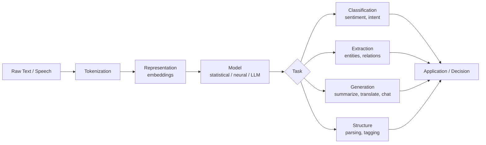
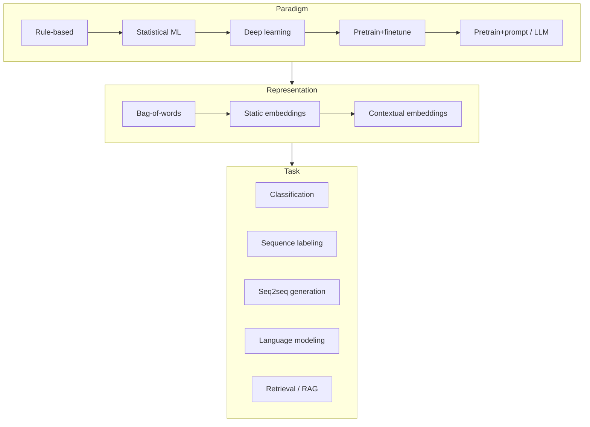
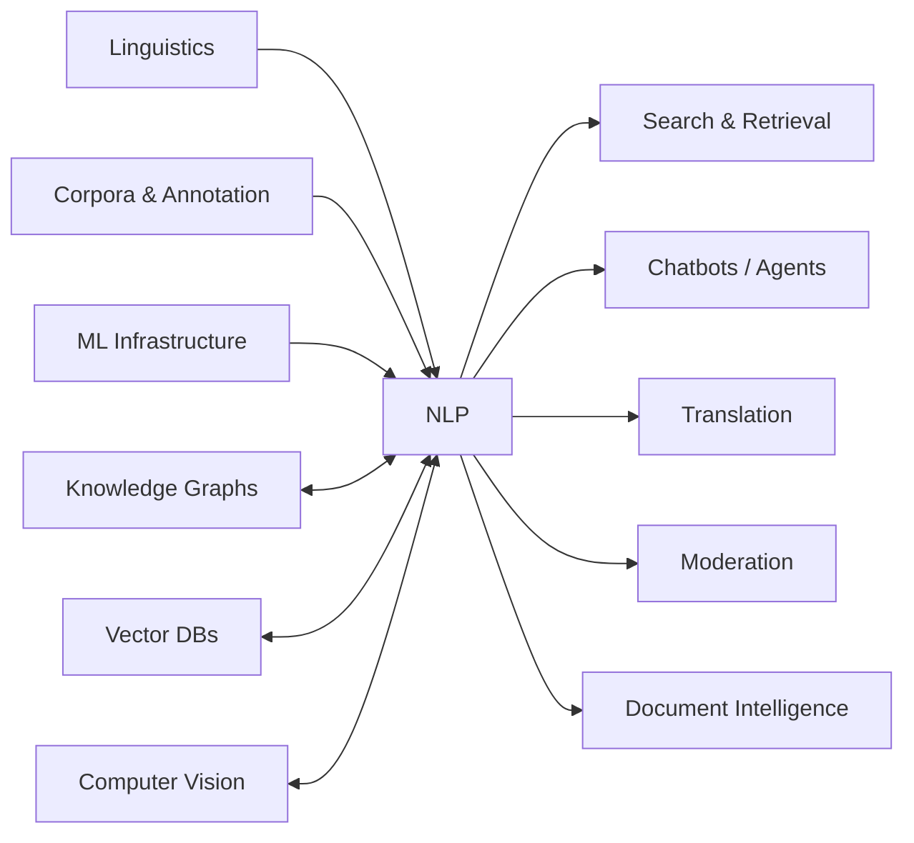

# Learning Map: Natural Language Processing (NLP)

## 1. Essence

**What is it fundamentally?**
NLP is the field concerned with building systems that convert human language — inherently ambiguous, context-dependent, and unstructured — into representations a machine can compute over, and back again. It sits at the intersection of linguistics (structure of language), statistics/ML (learning patterns from data), and computer science (representation and computation).

**Why does it exist?**
Most of the world's knowledge, communication, and intent is expressed in natural language, not in structured data. Any system that needs to read, understand, generate, or act on human text or speech needs NLP.

**What problem does it solve?**
Bridging the gap between unstructured human expression and structured machine reasoning: extracting meaning, intent, and structure from text/speech, and producing text/speech that a human finds coherent and appropriate.

**What did people do before it?**
- Manual rule-based text processing (regex, keyword search, hand-written grammars).
- Human-only reading/summarizing/translating.
- Structured forms and controlled vocabularies to avoid free text entirely (e.g., dropdowns instead of text boxes) because unstructured text was too hard to process reliably.

**What new possibilities does it create?**
- Machines that can search, summarize, translate, and converse at population scale.
- Interfaces where natural language *is* the API (chat, voice assistants, agents).
- Extraction of structured knowledge from previously "dark" unstructured data (documents, logs, transcripts).

Focus is on **why NLP exists**, not on how to call a specific tokenizer or library — assume AI/tools handle the mechanics.

---

## 2. World Model

**Objects**
- **Text/Speech** — the raw signal (characters, words, audio waveforms).
- **Tokens** — the atomic units a model operates on (subword pieces, words).
- **Representations** — embeddings/vectors that encode meaning geometrically.
- **Models** — statistical/neural systems that map representations to predictions (classification, generation, structure).
- **Annotations/Labels** — the "ground truth" structure humans impose (POS tags, entities, sentiment, intents).
- **Corpora/Datasets** — collections of text used to train/evaluate.

**Actors**
- **Language producers** — humans (or other systems) generating text/speech.
- **Language consumers** — downstream systems or humans that need meaning extracted.
- **Model builders** — researchers/engineers who train and tune models.
- **Annotators** — humans (or LLMs-as-annotators) who supply labeled examples.

**State changes**
Raw text → tokenized → embedded → processed by a model → task-specific output (label, span, generated text, structured object) → consumed by an application.

**Workflows**
1. Define the task (classification, extraction, generation, translation, etc.).
2. Acquire/prepare data (or rely on a pretrained model's existing knowledge).
3. Choose a representation strategy (symbolic rules → statistical → embeddings → pretrained transformers → LLMs).
4. Train/fine-tune or prompt a model.
5. Evaluate against task-appropriate metrics.
6. Deploy and monitor for drift (language changes, distribution shifts).

**Systems**
- Preprocessing pipelines (normalization, tokenization).
- Model training/inference infrastructure.
- Evaluation harnesses.
- Serving/integration layers (APIs, agents, RAG pipelines).

**Value**
Value is created wherever meaning must be extracted from or generated as language, at a scale or speed no human team can match — search, moderation, summarization, translation, customer support, coding assistants, scientific literature mining.

---

## 3. Concept Map

Three conceptual layers: **Representation**, **Task**, **Paradigm**.

### Layer 1 — Representation (how language becomes numbers)
| Entity | Action | Purpose | Relationships |
|---|---|---|---|
| Bag-of-words / TF-IDF | Counts word frequency, ignores order | Cheap baseline features | Precursor to embeddings |
| Word embeddings (Word2Vec, GloVe) | Maps words to dense vectors by co-occurrence | Capture semantic similarity | Static — one vector per word regardless of context |
| Contextual embeddings (BERT-style) | Vector depends on surrounding context | Disambiguate meaning by context | Enabled by transformer architecture |
| Subword tokenization (BPE, WordPiece) | Splits words into reusable pieces | Handle rare/unseen words, fixed vocabulary | Feeds every modern model's input layer |

### Layer 2 — Task (what you're trying to accomplish)
| Entity | Action | Purpose | Relationships |
|---|---|---|---|
| Classification (sentiment, topic, intent) | Assigns a label to a text span | Route, filter, or score content | Often the "hello world" of applied NLP |
| Sequence labeling (NER, POS tagging) | Assigns a label per token | Extract structured entities from text | Foundation for information extraction |
| Sequence-to-sequence (translation, summarization) | Maps input text to different output text | Transform meaning across languages/lengths | Basis of modern generative NLP |
| Language modeling (next-token prediction) | Predicts likely continuations | Underlies generation, is the pretraining objective for LLMs | Everything downstream now builds on this |
| Information retrieval / RAG | Finds relevant text given a query | Ground generation in external knowledge | Bridges symbolic search and generative models |

### Layer 3 — Paradigm (how the field's approach has shifted)
| Entity | Action | Purpose | Relationships |
|---|---|---|---|
| Rule-based / symbolic | Hand-written grammars, regex | High precision on narrow domains | Predecessor, still used for structured/legal text |
| Statistical ML | Learns weights from labeled features | Generalizes better than rules | Needs feature engineering |
| Deep learning (RNN/LSTM → Transformer) | Learns features automatically from data | Removes manual feature engineering | Transformer architecture unlocked scale |
| Pretrain + fine-tune | Learn general language first, specialize later | Reuse knowledge across tasks, reduce labeled data needs | Foundation of BERT-era NLP |
| Pretrain + prompt (LLMs) | Use one large model for many tasks via instructions | Removes need for task-specific fine-tuning in many cases | Current dominant paradigm |

---

## 4. Decision Map

| Situation | Decision | Reason | Expected Outcome |
|---|---|---|---|
| You have a narrow, well-defined, high-volume classification task and labeled data | Fine-tune a small model (or classic ML on embeddings) | Cheaper inference, more predictable, easier to audit | Fast, low-cost, stable classifier |
| You have a novel or shifting task, little labeled data, need flexibility | Prompt an LLM (zero/few-shot) | No training needed, adapts instantly to new instructions | Fast to prototype, but higher per-call cost and less predictable |
| You need answers grounded in a private/changing knowledge base | Use retrieval-augmented generation (RAG) instead of fine-tuning facts in | Facts stay current without retraining; reduces hallucination | Answers cite/ground in retrieved documents |
| Domain has very specific jargon/structure (legal, medical, code) | Consider domain-specific pretrained models or rule-based pre/post-processing | General models may mishandle domain conventions | Higher precision on domain-specific patterns |
| You need to extract structured fields from free text at scale | Sequence labeling / structured extraction model, not free-form generation | Structured output is easier to validate and pipe into systems | Reliable, schema-conformant extraction |
| Latency or cost budget is tight and task is simple | Prefer smaller/classical models over LLMs | LLM calls are the most expensive/slow option per unit of accuracy for simple tasks | Efficient system at scale |
| You're unsure what taxonomy/labels even apply | Start with unsupervised/LLM-assisted exploration (clustering, open-ended labeling) before committing to a fixed schema | Committing to labels too early can misfit the real data distribution | A validated, data-driven taxonomy before scaling annotation |

---

## 5. Search Space Expansion

**Beginner questions rarely asked**
- Why do models need tokens instead of characters or raw words?
- What actually breaks when text is in a language the model wasn't trained much on?
- Why can a model be fluent but factually wrong (what is "meaning" to a language model)?

**Questions experts ask**
- Where does this task's performance ceiling come from — data, architecture, or evaluation metric mismatch?
- Is the error a representation problem (model can't "see" the distinction) or a decision-boundary problem (it sees it but weighs it wrong)?
- What's the annotation disagreement rate among humans, and does it bound achievable model accuracy?
- Is scaling the model/data the right lever, or is the task fundamentally underspecified?

**Questions worth exploring next**
- How does your task's label taxonomy interact with real-world ambiguity (multi-label, hierarchical, fuzzy boundaries)?
- What's the cost of a false positive vs. false negative in your specific application, and does your model/threshold reflect that?
- How will you detect distribution shift (new slang, new topics, adversarial inputs) after deployment?

**Questions that define mastery**
- Can you predict, before running an experiment, which architecture/paradigm will win for a given data size and task shape?
- Can you diagnose whether a failure is a data problem, an evaluation problem, or a modeling problem — without re-running experiments blindly?
- Can you design an evaluation that actually measures what the business needs, rather than what's convenient to compute?

---

## 6. Ecosystem

**Upstream** (what NLP depends on)
- Linguistics (syntax, semantics, pragmatics) for task/label design.
- General ML/deep learning infrastructure (training frameworks, hardware).
- Data — raw corpora, annotation processes and tooling.

**Downstream** (what depends on NLP)
- Search engines, chatbots/agents, translation services, content moderation, document intelligence, coding assistants, voice assistants, recommendation systems that use text signals.

**Alternatives**
- Structured input design (forms, controlled vocabularies) to avoid needing NLP at all.
- Human-in-the-loop processing for low-volume, high-stakes text tasks.
- Symbolic/rule-based systems for narrow, stable-format domains (e.g., invoice parsing with fixed templates).

**Complements**
- Computer vision (multimodal systems combining text + image/audio).
- Knowledge graphs / structured databases (NLP extracts into them; they ground NLP's outputs).
- Retrieval systems / vector databases (pair with generative models for RAG).
- Human annotation/QA workflows (label the data, evaluate the outputs).

---

## 7. Transferable Principles

**First principles**
- Meaning is context-dependent; the same token can mean different things in different contexts — any representation that ignores context has a ceiling.
- All language data has an inherent ambiguity/noise floor (human annotators disagree) — no model can exceed that ceiling on the same evaluation.
- More general-purpose representations (pretraining) transfer better than task-specific ones when data is scarce.

**Transferable methodologies**
- Separate representation learning from task learning (pretrain, then adapt) — applies far beyond NLP (vision, audio).
- Always benchmark against human agreement rate, not just against 100% accuracy.
- Start with the cheapest baseline (rules, TF-IDF) before reaching for the most complex model — it calibrates how hard the task really is.

**Implementation details** (expected to change, don't over-invest in memorizing)
- Specific tokenizer algorithms (BPE vs. WordPiece vs. SentencePiece).
- Specific model architectures and their exact parameter counts.
- Current state-of-the-art model names/benchmarks.

**Stable knowledge**
- The representation → task → evaluation pipeline shape.
- The tradeoff triangle: accuracy vs. latency/cost vs. flexibility.
- The idea that ambiguity is inherent to language, not a bug to be fully eliminated.

**Changing knowledge**
- Which paradigm currently dominates (rules → statistical → deep learning → LLMs) — this shifts every few years.
- Cost/latency tradeoffs of specific model classes (shifts constantly with new releases).

---

## 8. Minimum Mental Model

If you remember only these, you retain most of the field's leverage:

1. Text must become numbers (tokens → embeddings) before any model can use it.
2. Context changes meaning — contextual representations beat static ones.
3. Pretraining on general language, then adapting (fine-tune or prompt) to a task, is the dominant strategy.
4. Classification, sequence labeling, and generation are the three fundamental task shapes.
5. Language modeling (predict the next token) is the pretraining objective behind most modern generative NLP.
6. Rules → statistics → deep learning → LLMs is a paradigm progression, not a strict replacement — each still has a fit.
7. Human label disagreement sets a ceiling on achievable accuracy for any task.
8. Fine-tuning trades flexibility for efficiency; prompting trades efficiency for flexibility.
9. Retrieval-augmented generation grounds a model in facts it wasn't trained on and keeps them current.
10. Evaluation metric choice determines what "good" even means — pick it to match the real cost of errors.
11. Distribution shift (new language patterns, slang, domains) degrades any static model over time.
12. Preprocessing/tokenization choices quietly bound what a model can ever learn to distinguish.
13. Structured extraction (spans, fields) is more auditable and pipeline-friendly than free-text generation.
14. The cost/latency/accuracy tradeoff should drive model choice, not "use the biggest model."
15. Domain-specific text (legal, medical, code) often violates general-model assumptions and needs special handling.

---

## 9. Common Misconceptions

| Misconception | Why it happens | Better mental model |
|---|---|---|
| "A model that writes fluent text understands what it's saying." | Fluency and factual grounding are produced by different mechanisms; humans conflate style with substance. | Fluency reflects learned language *patterns*; truthfulness requires grounding (retrieval, verification), not just fluent generation. |
| "More data / bigger model always wins." | Scaling has produced dramatic, visible gains recently. | Returns diminish and depend on task shape; a well-labeled small dataset can beat a huge general model on a narrow, well-defined task. |
| "NLP tasks have one correct answer, so 100% accuracy is the target." | Machine learning framing implies a ground truth. | Human annotators often disagree; the real ceiling is human agreement rate, not 100%. |
| "Once fine-tuned/prompted well, the model will keep performing the same." | Deployment feels like a finish line. | Language and user behavior drift; models need monitoring and periodic re-evaluation, the same as any other production system. |
| "LLMs make classical NLP techniques (TF-IDF, rules, small classifiers) obsolete." | LLMs dominate current discourse and demos. | Classical techniques remain the right choice for cheap, high-volume, well-defined tasks — bigger isn't always better on the cost/accuracy tradeoff. |
| "Prompting an LLM well is the same as understanding the task." | Prompting feels like "just asking" rather than modeling. | Good prompting still requires clear task definition, evaluation, and error analysis — the rigor doesn't disappear, it moves. |

---

## 10. Summary

> What I truly gain is not **the ability to call an NLP library or write a prompt**, but **a model for how meaning moves from unstructured human language into structured, actionable representations — and the judgment to choose which paradigm (rules, classical ML, fine-tuning, or prompting an LLM) fits a given task's accuracy, cost, and flexibility requirements.**
