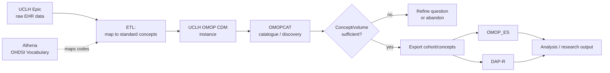
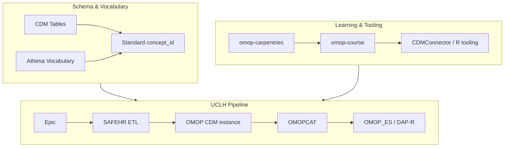
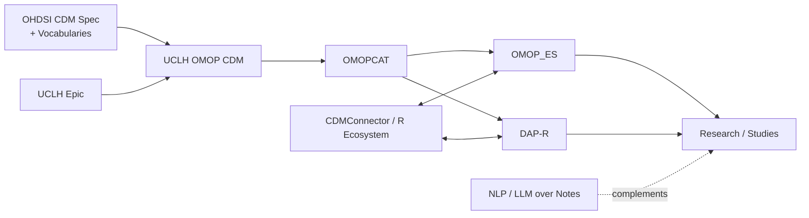

# Learning Map: OMOP at UCLH

## 1. Essence

**What is it fundamentally?**
OMOP (Observational Medical Outcomes Partnership) is a **Common Data Model (CDM)** — a fixed relational schema plus a standardized vocabulary — that reshapes messy, hospital-specific electronic health record (EHR) data into one consistent structure. At UCLH, "OMOP" isn't one tool; it's a whole local stack built around that schema: raw Epic EHR data is transformed into OMOP CDM tables, catalogued so people can find what exists, taught to new users, and exported into downstream analysis tools.

**Why does it exist?**
Every hospital records the same clinical reality (a diagnosis, a drug given, a lab result) in a different local schema, using different code systems, different table names, different quirks. A researcher who wants to ask a question across multiple sites — or even just wants a query that survives the next Epic upgrade — cannot write one query against N different schemas. OMOP exists so that "find every patient with condition X" is the *same query* regardless of which hospital's EHR the data came from.

**What problem does it solve?**
Two problems at once: (1) **structural heterogeneity** — different systems store the same fact in different tables/columns — solved by the fixed CDM schema (PERSON, CONDITION_OCCURRENCE, DRUG_EXPOSURE, etc.); and (2) **semantic heterogeneity** — the same clinical fact coded differently (local Epic codes, ICD-10, SNOMED, local lab codes) — solved by mapping every fact to a single **standard concept** from the OHDSI vocabulary.

**What did people do before it?**
- Bespoke, one-off SQL against the raw EHR/warehouse schema, rewritten for every new question and broken by every schema change.
- Manual chart review to resolve coding inconsistencies.
- Study-specific extracts that couldn't be reused, compared across sites, or handed to someone else without re-explaining the schema from scratch.
- Multi-site studies requiring a local analyst at each site to hand-translate the same protocol into that site's own data structure.

**What new possibilities does it create?**
- Federated, multi-site research (the whole point of OHDSI) — the same analysis code runs unmodified at UCLH and at any other OMOP-mapped site.
- A **discovery layer** (OMOPCAT) that lets a researcher check whether UCLH even has enough of a given concept, in what date range, *before* writing a single query or requesting an extract.
- Standardized tooling built once, by the community, and reused everywhere (cohort definitions, characterization tools, R/Python packages like `CDMConnector`) instead of rebuilt per hospital.
- A stable teaching target: because the schema is fixed and shared, UCLH can run one training course (`omop-course`, `omop-carpentries`) instead of retraining every analyst on a bespoke local warehouse.

---

## 2. World Model

**Objects**
- **CDM tables** — the fixed relational schema (PERSON, VISIT_OCCURRENCE, CONDITION_OCCURRENCE, DRUG_EXPOSURE, PROCEDURE_OCCURRENCE, MEASUREMENT, OBSERVATION, DEVICE_EXPOSURE, DEATH, and supporting vocabulary/metadata tables).
- **Concept / concept_id** — the atomic unit of meaning: every clinical fact resolves to one standard `concept_id` from the OHDSI vocabulary, regardless of how it was originally coded.
- **Source value / source concept_id** — the original local code (Epic's own code, a local lab code), preserved alongside the standard concept for audit/traceability.
- **Vocabulary** — the standardized coding systems OMOP maps onto (SNOMED-CT for conditions, RxNorm for drugs, LOINC for measurements, etc.), browsed via **Athena**.
- **Person_id / visit_occurrence_id** — the linking keys that tie every clinical event back to a patient and an encounter.

**Actors**
- **UCLH Epic** — the source EHR system where clinical care is actually documented.
- **SAFEHR** (UCLH's data/informatics team) — builds and governs the pipeline that transforms Epic data into OMOP CDM, and maintains OMOPCAT, `omop-course`, and `omop-carpentries`.
- **OHDSI / OMOP CDM working group** — the international community that defines and versions the CDM schema and vocabulary (external upstream authority, not UCLH-specific).
- **Researchers / clinical analysts** — the end users who browse OMOPCAT, request/receive an OMOP extract, and query it (often via R/`CDMConnector`, sometimes SQL directly).
- **Downstream applications** — OMOP_ES and DAP-R, which consume exports/extracts for analysis.

**State changes**
Raw Epic clinical documentation → **ETL** (extract-transform-load) maps local codes to standard concepts and reshapes rows into CDM tables → OMOP CDM instance (a full copy of UCLH's clinical data in the standard schema) → **OMOPCAT** indexes it into a browsable, privacy-safe catalogue (aggregated quarterly counts only) → a researcher searches OMOPCAT, decides a concept/date range is worth pursuing → requests or exports the underlying data → data lands in **OMOP_ES** or **DAP-R** for actual analysis.

**Workflows**
1. Epic data is ETL'd into the UCLH OMOP CDM instance, with local codes mapped to Athena standard concepts.
2. A researcher browses **OMOPCAT** to check concept availability and volume *before* committing to a study design.
3. The researcher (new to OMOP) works through **omop-course** or **omop-carpentries** to learn the schema and R tooling (`CDMConnector`, `dplyr`, `duckdb`, Parquet files).
4. The researcher exports a defined concept set / cohort from OMOPCAT into **OMOP_ES** or **DAP-R**.
5. Analysis is run against the CDM tables using standard OHDSI-ecosystem tooling, producing results that are — in principle — comparable to the same analysis run at another OMOP site.

**Systems**
- The ETL pipeline (Epic → OMOP CDM) — mostly invisible to end users, owned by SAFEHR.
- **Athena** (athena.ohdsi.org) — the global OHDSI vocabulary browser; not UCLH-specific, but essential to interpreting any UCLH OMOP data correctly.
- **OMOPCAT** — UCLH's local, privacy-preserving discovery/catalogue layer on top of the CDM.
- **OMOP_ES / DAP-R** — UCLH's downstream analysis environments.
- Training systems: **omop-course** (2-day taught/self-directed course) and **omop-carpentries** (the underlying Carpentries-style lesson repo).

**Value**
Value shows up wherever someone needs to ask a question of UCLH's clinical data without re-learning Epic's raw schema, without waiting for a bespoke SQL build, and ideally in a form that could later be compared against other hospitals: feasibility checks before a grant application, cohort definition for a study, safety/toxicity audits, and any multi-site OHDSI network study UCLH participates in.

---

## 3. Concept Map

Three conceptual layers: **Schema & Vocabulary** (what the data looks like), **UCLH Pipeline** (how UCLH data gets into and out of that shape), and **Learning & Tooling** (how a person gets competent enough to use it).

### Layer 1 — Schema & Vocabulary (the CDM itself)
| Entity | Action | Purpose | Relationships |
|---|---|---|---|
| PERSON table | Anchors every record to one patient | Identity hub for all clinical events | Every other clinical table has a `person_id` foreign key into it |
| VISIT_OCCURRENCE | Represents one patient-provider encounter | Contextualizes *when/where* an event happened | Most clinical event tables optionally reference a `visit_occurrence_id` |
| CONDITION_OCCURRENCE / DRUG_EXPOSURE / PROCEDURE_OCCURRENCE / MEASUREMENT / OBSERVATION | Record diagnoses, drugs, procedures, test results, and catch-all clinical facts respectively | Domain-specific homes for clinical facts, each with a defined grain | Share the same pattern: `person_id`, a standard `concept_id`, dates, and a `source_value` |
| Standard concept_id | Maps every fact to one vocabulary-standard code | Enables cross-site, cross-coding-system comparability | Populated via Athena's vocabulary; source code kept in parallel `*_source_value` |
| Athena (vocabulary browser) | Lets a human search/browse standard concepts (SNOMED, RxNorm, LOINC, etc.) | The reference tool for "what concept_id represents X clinically?" | Underpins every ETL mapping decision and every concept-based query |

### Layer 2 — UCLH Pipeline (data → discoverable → usable)
| Entity | Action | Purpose | Relationships |
|---|---|---|---|
| Epic (source EHR) | Captures clinical care as it happens | The ground truth of what was actually done/documented | Feeds the ETL that builds UCLH's OMOP CDM instance |
| SAFEHR ETL | Transforms Epic data into OMOP CDM tables, mapping local codes to standard concepts | Produces UCLH's queryable OMOP CDM instance | Bridges Epic and everything downstream (OMOPCAT, OMOP_ES, DAP-R) |
| OMOPCAT | Catalogues available OMOP data as aggregated, anonymised quarterly counts | Lets researchers check feasibility *before* requesting real data | Sits between the CDM instance and any data export/request |
| OMOP_ES / DAP-R | Downstream applications where exported concepts/cohorts are actually analysed | Where the research question gets answered | Consume exports produced from OMOPCAT/the CDM instance |

### Layer 3 — Learning & Tooling (getting competent)
| Entity | Action | Purpose | Relationships |
|---|---|---|---|
| omop-course (SAFEHR) | 2-day taught/self-directed course on the CDM + R tooling | Onboards clinicians/analysts new to OMOP | Built on the omop-carpentries lesson material |
| omop-carpentries (GitHub repo) | Carpentries-style lesson episodes: what is OMOP, concepts, Parquet, measurements/observations, conditions/visits, medications, dates | Open, versioned, community-style training content | Source material rendered as the omop-course site |
| CDMConnector / dplyr / duckdb / arrow (R packages) | Query OMOP CDM Parquet/DB tables in R without hand-written SQL against the raw schema | Standard OHDSI-ecosystem tooling for CDM access | Taught in omop-course; used against real UCLH CDM/OMOP_ES data |

---

## 4. Decision Map

| Situation | Decision | Reason | Expected Outcome |
|---|---|---|---|
| You're new to OMOP and don't know the schema | Work through `omop-course` / `omop-carpentries` before touching real UCLH data | The schema and concept model are unintuitive coming from raw EHR/SQL habits; the course front-loads that learning | Faster, fewer wrong-table/wrong-concept mistakes once you reach real data |
| You want to know if a study is even feasible at UCLH | Check **OMOPCAT** first, not a data request | It gives aggregated concept/volume counts without needing governance approval for a full extract | Fast go/no-go signal before investing in a formal request |
| You're unsure which code(s) represent a clinical concept (e.g. "colitis") | Browse **Athena** for the standard concept(s) and their descendants/mappings | Local/source codes are inconsistent; the standard concept is what the CDM actually stores | A concept_id (or set of related ones) you can trust across the whole CDM, not just one coding system |
| You need actual patient-level data to analyse | Export from OMOPCAT into **OMOP_ES** or **DAP-R**, don't query raw Epic tables | These are the governed, OMOP-shaped downstream environments meant for analysis | Analysis-ready CDM-structured data, with provenance back to source |
| Your question spans multiple hospitals/sites | Design the study against the **OMOP CDM standard**, not UCLH-specific fields | CDM structure/vocabulary is shared across OHDSI-network sites | The same cohort/analysis definition is (in principle) portable to other sites |
| A concept seems present in Athena but absent/sparse in OMOPCAT | Treat it as a UCLH data-capture or mapping gap, not a schema problem | The vocabulary is global; UCLH's actual captured data may not use/populate that concept | Adjust the study design or investigate the ETL mapping rather than assuming the concept doesn't exist |
| You need a one-off complex judgement call embedded in free text (e.g. clinical attribution, severity grading) | Recognize OMOP alone won't answer it — structured CDM tables surface *candidates*, not judgements | CONDITION_OCCURRENCE/OBSERVATION store coded facts, not narrative reasoning | Plan for a complementary approach (e.g. NLP/LLM over notes) rather than expecting SQL-only resolution |

---

## 5. Search Space Expansion

**Beginner questions rarely asked**
- Why does the same clinical event sometimes appear as multiple rows across different domain tables (e.g. both CONDITION_OCCURRENCE and OBSERVATION)?
- What happens to a fact that has *no* good standard concept — where does it go?
- Why does OMOPCAT only show counts, not records — what exactly is being protected, and from whom?

**Questions experts ask**
- Is a "missing" concept in UCLH's CDM a true absence in the clinical record, a documentation gap in Epic, or an ETL mapping failure?
- How stable is a given concept_id's meaning across CDM vocabulary versions — could a query written today silently mean something different after a vocabulary refresh?
- Where does UCLH's ETL make judgement calls (e.g. collapsing local lab codes onto a single LOINC concept) that could bias a downstream analysis?
- How does data latency (Epic → ETL → CDM → OMOPCAT) affect the currency of what a researcher sees?

**Questions worth exploring next**
- What's UCLH's actual process for requesting a full patient-level extract once OMOPCAT confirms feasibility — who approves it, how long does it take?
- How does UCLH's OMOP CDM instance handle data types Epic captures but the base CDM domains don't cleanly fit (e.g. free-text clinical narrative, structured oncology-specific fields)?
- What's the update/versioning cadence for UCLH's CDM instance and vocabulary — daily, nightly, quarterly?
- How does OMOP_ES differ from DAP-R in practice — when would you choose one over the other?

**Questions that define mastery**
- Can you predict, from a research question's shape alone, whether OMOP's structured tables will suffice or whether you'll need to go back to source narrative/notes?
- Can you read an OMOPCAT count and correctly infer *why* it's low — true rarity, a coding/mapping gap, or a date-range artifact — without guessing?
- Can you design a cohort definition that would port cleanly to another OHDSI-network site, not just work for UCLH's specific ETL quirks?
- Can you trace a single analysis-ready row in OMOP_ES all the way back to the Epic source event and vocabulary mapping that produced it?

---

## 6. Ecosystem

**Upstream** (what UCLH's OMOP setup depends on)
- OHDSI's OMOP CDM specification and governance (the schema version UCLH implements, e.g. CDM v5.4).
- Athena / the OHDSI standardized vocabularies (SNOMED-CT, RxNorm, LOINC, ICD-10, etc.) that every mapping decision relies on.
- UCLH Epic as the source-of-truth EHR system.
- The Carpentries lesson framework, which `omop-carpentries` is built on.

**Downstream** (what depends on UCLH's OMOP CDM)
- OMOPCAT (discovery/catalogue).
- OMOP_ES and DAP-R (analysis environments).
- Individual research studies, feasibility assessments, and any UCLH participation in multi-site OHDSI network studies.
- Trained researchers/analysts who go on to build cohort definitions, characterizations, and downstream tools (e.g. R packages, dashboards) on top of CDM data.

**Alternatives**
- Querying the raw Epic/warehouse schema directly — faster for a single one-off question, but not reusable, not comparable across sites, and requires deep local schema knowledge.
- Bespoke local data marts built for one study — avoids CDM overhead but can't be shared or federated.
- Manual chart review — necessary for the judgement calls OMOP's structured tables can't make, but doesn't scale.

**Complements**
- NLP/LLM-based extraction over clinical narrative — fills the gap where OMOP's structured tables can only surface *candidates*, not clinical judgements (e.g. attribution, severity grading).
- R/Python OHDSI tooling ecosystem (`CDMConnector`, `dplyr`, `duckdb`, Parquet, and beyond it packages like `CohortGenerator`, `FeatureExtraction`) — the standard way to actually query a CDM instance rather than hand-rolling SQL.
- Data governance processes at UCLH (the approval layer that sits around OMOPCAT → export → OMOP_ES/DAP-R).

---

## 7. Transferable Principles

**First principles**
- A common data model trades local fidelity for cross-site comparability — every mapping decision (local code → standard concept) is a small act of standardization that makes broad queries possible at the cost of some local nuance.
- Structured, coded data (what OMOP stores) and clinical judgement/narrative (what generated it) are not the same thing — the CDM captures the *coded record* of care, not the reasoning behind it.
- Discovery should precede extraction: check whether the data plausibly exists and at what volume before committing to the cost of a full request/build.

**Transferable methodologies**
- Before writing any query, resolve the concept in the vocabulary (Athena) first — don't guess at codes.
- Treat "concept present but sparse" and "concept absent" as different findings requiring different investigation (mapping gap vs. true rarity vs. date-range issue).
- When a question requires judgement the coded data can't express, plan a complementary extraction method (NLP/LLM, manual review) rather than forcing SQL to answer it alone.

**Implementation details** (expected to change, don't over-invest in memorizing)
- Exact CDM table/column names for a specific version (schema evolves, e.g. v5.3 → v5.4 changed some tables).
- Specific R package versions/APIs (`CDMConnector` and friends).
- UCLH's specific governance/request process for OMOP_ES vs. DAP-R access.

**Stable knowledge**
- Epic (source) → ETL/standardization → CDM instance → discovery/catalogue → export → analysis is the durable pipeline shape, regardless of which specific tools sit at each stage.
- The standard-concept-plus-source-value pattern (keep the mapping *and* the original) is the core traceability mechanism of any CDM-based system.
- OMOP answers "what was coded/recorded," not "what was clinically true or why" — that gap is structural, not a UCLH-specific limitation.

**Changing knowledge**
- Which CDM version UCLH is on, and which vocabulary release Athena reflects at a given time.
- OMOPCAT's specific feature set and what's currently exportable to OMOP_ES/DAP-R.
- The current syllabus/tooling taught in `omop-course` / `omop-carpentries`.

---

## 8. Minimum Mental Model

If you remember only these, you retain most of the field's leverage:

1. OMOP is a fixed schema (CDM) plus a standardized vocabulary — it solves both "different table structures" and "different codes for the same thing" at once.
2. Every clinical fact maps to one standard `concept_id`, while the original local code is preserved in a parallel `source_value` — nothing is lost, but everything gains a common label.
3. **Athena** is where you look up what a concept_id actually represents, and the reference for how UCLH's ETL should have mapped a local code.
4. At UCLH, the pipeline is Epic (source) → SAFEHR ETL → UCLH OMOP CDM instance → **OMOPCAT** (discovery) → **OMOP_ES / DAP-R** (analysis).
5. OMOPCAT shows aggregated, privacy-safe counts so you can check feasibility *before* requesting real patient-level data.
6. PERSON is the identity hub; almost every other clinical table links back to it via `person_id`, often via a `visit_occurrence_id` for context.
7. Because the schema and vocabulary are shared across OHDSI-network sites, an analysis built for UCLH's OMOP CDM can, in principle, run unmodified elsewhere.
8. OMOP captures the *coded record* of care, not the clinical reasoning behind it — judgement calls (attribution, severity) require complementary methods (narrative review, NLP/LLM), not more SQL.
9. `omop-course` / `omop-carpentries` are UCLH's on-ramp: they teach the schema plus the standard R tooling (`CDMConnector`, `dplyr`, `duckdb`) rather than raw SQL against Epic.
10. A "missing" concept in UCLH's data could be true absence, a documentation gap, or a mapping failure — never assume without checking Athena and the ETL logic.

---

## 9. Common Misconceptions

| Misconception | Why it happens | Better mental model |
|---|---|---|
| "OMOP is just UCLH's data warehouse under a different name." | It's the thing researchers query instead of raw Epic tables, so it feels like "the" database. | OMOP is a standardized *reshaping* of UCLH's data specifically designed to be comparable with other hospitals' OMOP data — the value is in the standardization, not just having a queryable copy. |
| "If OMOPCAT shows a low count, the data doesn't exist at UCLH." | The count is treated as ground truth about clinical reality. | A low count can mean true rarity, an ETL mapping gap, or a source-documentation gap — it needs investigation, not literal acceptance. |
| "Athena and OMOPCAT are the same kind of tool, just for different data." | Both are "browse and search" web interfaces in the same ecosystem. | Athena browses the *global, abstract vocabulary* (what concepts exist and how they relate); OMOPCAT browses *UCLH's actual captured data* against that vocabulary (what's really there, in what volume). |
| "Once data is in OMOP CDM, any clinical question can be answered with a query." | The CDM looks exhaustive — tables for conditions, drugs, procedures, measurements, observations. | OMOP stores coded facts, not clinical judgement or narrative reasoning; questions requiring attribution, severity grading, or nuance from free text need a complementary method. |
| "Learning OMOP means learning SQL against the CDM tables." | Most CDM documentation shows SQL examples. | At UCLH, the taught path (`omop-course`) is R-based (`CDMConnector`, `dplyr`, `duckdb`, Parquet) — SQL literacy helps but isn't the primary tool being taught. |
| "A concept_id means the same thing forever." | Concept IDs look like stable, permanent identifiers. | Vocabularies version and get refreshed; a concept's mappings/relationships (and occasionally its standard/non-standard status) can change between vocabulary releases — check the version in play. |

---

## 10. Summary

> What I truly gain is not **the ability to query UCLH's OMOP tables**, but **a model for how raw Epic clinical data becomes standardized, discoverable, and comparable — via a fixed schema (CDM), a shared vocabulary (Athena), a local discovery layer (OMOPCAT), and downstream analysis environments (OMOP_ES, DAP-R) — and the judgement to know when that structured, coded record is enough to answer a question, versus when it only surfaces candidates that still need clinical reasoning or narrative review to resolve.**
