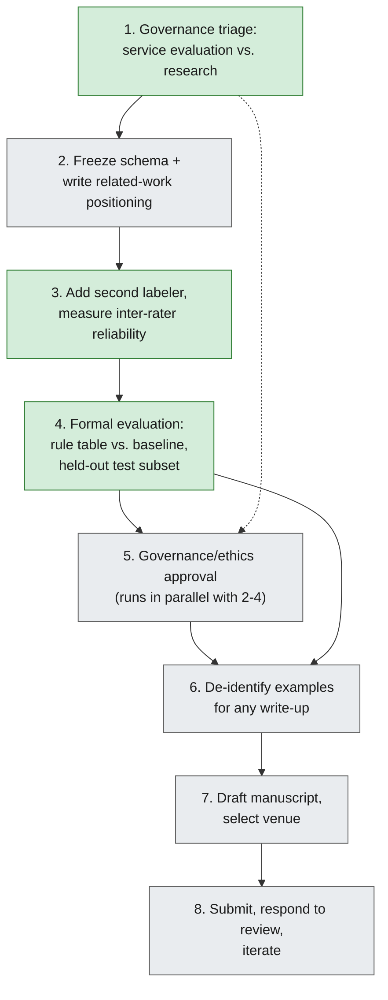

# Publishing the Classifier Project

*Detailed discussion of whether and how the Classifier project (see `Ideas/Classifier/Classifier and Rationale V2.md`) could be published, with a step-by-step flow, barriers, and solutions for each step.*

## Verdict

Publishable — but as a **methods/informatics practice paper**, not a large-scale ML validation paper. The genuine novelty claim (no published schema classifies data-extraction requests) is real and defensible, but several methodological gaps need closing first, and one governance decision needs making before anything else.

## Essential things to do first

These three are the load-bearing items — everything else in the flow below is easier or optional by comparison, but skipping these will sink a submission at review:

1. **Get a governance decision** (service evaluation vs. research) before drafting anything for external audiences. This determines whether REC approval is needed at all, and how long the whole path takes.
2. **Add a second labeler and measure inter-rater reliability** on a subset of requests (even 20–30). Right now "the clinician judges the best method" is one person's opinion with no agreement measure — the single weakest point in the methodology as it stands.
3. **Freeze the schema and hold out a test subset** before evaluating the rule table, so the evaluation isn't circular (rules derived from and tested on the same requests).

## Step-by-step flow, with barriers and solutions

### 1. Governance triage — service evaluation vs. research
- **What:** Decide with your institution's R&D office / information governance whether this counts as a service evaluation (no ethics review needed) or research (needs REC review).
- **Barrier:** Categorization criteria are often unclear from the outside, and getting it wrong wastes months.
- **Solution:** Raise this early and in parallel with everything else, not after a draft exists. Use your institution's standard research-vs-audit-vs-service-evaluation decision tool if one exists (most NHS trusts have one); ask the R&D office directly rather than guessing.

### 2. Freeze the schema and write related-work positioning
- **What:** Lock the CLEF-extended schema (entity/relation/timeline + extraction method) as a versioned artifact (V2 is that version), and write the related-work section now — citing the CLEF eHealth schema and the [cohort-retrieval query taxonomy](https://www.medrxiv.org/content/10.1101/19012294v1) — so the novelty claim is stated precisely before more work is built on top of it.
- **Barrier:** The schema is still evolving informally through conversation; nothing has been version-locked or compared systematically against prior art yet.
- **Solution:** Treat `Classifier and Rationale V2.md` as the frozen reference point for the schema going forward; any further schema changes should produce a V3, not silent edits to V2.

### 3. Add a second labeler, measure inter-rater reliability
- **What:** Recruit a second clinician (or informatics colleague) to independently judge "best extraction method" on a defined subset of requests (20–30 is enough to compute agreement).
- **Barrier:** Needs a second person's time and a defined disagreement-resolution process, neither of which exist yet.
- **Solution:** Ask early — this is cheap in absolute terms but has long lead time if scheduled late. Report agreement with Cohen's kappa. Decide up front how disagreements get adjudicated (e.g. a third opinion, or discussion to consensus).

### 4. Formal evaluation of the rule table
- **What:** Hold out a subset of requests not used to derive the rules, evaluate the rule table's routing decisions against actual clinician-chosen methods, and compare to a naive baseline (e.g. "always use SQL"). Report precision/recall or accuracy per extraction method.
- **Barrier:** No baseline or held-out set currently exists; evaluating on the same requests used to build the rules would be circular and reviewers will catch it.
- **Solution:** Split before analysis begins, not after — decide the held-out subset at the same time the schema is frozen (step 2), so it's never touched during rule derivation.

### 5. Governance/ethics approval
- **What:** Formal sign-off to use and potentially publish request data, once step 1 has determined which pathway applies.
- **Barrier:** Even aggregate, request-level data derived from cancer patients may need sign-off; approval timelines can be long and are often the critical path.
- **Solution:** Start this conversation in parallel with steps 2–4, not after a manuscript is drafted — treat it as the schedule-driving step, not an afterthought.

### 6. De-identify examples for any write-up
- **What:** Redact or generalize any example requests used as illustrations (e.g. Request 22-style case studies) before they appear in anything shared externally.
- **Barrier:** Request write-ups may contain identifiable project or patient-adjacent details not obvious at a glance.
- **Solution:** Build a simple redaction checklist (project names, dates, drug/dose specifics if identifying, any free text pulled from real notes) and have information governance review examples before submission, not after acceptance.

### 7. Draft manuscript and select venue
- **What:** Write up the schema, the labeling process, the rule-table evaluation, and the strengths/limitations (see V2 doc) as a manuscript targeting one of:
  - **JAMIA Open**, **BMJ Health & Care Informatics**, or **International Journal of Medical Informatics** — full paper, methods/practice framing.
  - **AMIA Informatics Summit** or **MedInfo** — shorter conference paper.
  - **CLEF eHealth workshop** — a natural fit, since the contribution is explicitly an extension of their schema into a new problem domain.
- **Barrier:** Uncertain which venue fits without informal feedback first; drafting fully before getting any signal risks wasted effort.
- **Solution:** Draft the abstract first, get informal feedback from your boss/mentor, and if possible make informal contact with a target venue (e.g. a CLEF eHealth organizer) before committing to a full draft.

### 8. Submit, respond to review, iterate
- **What:** Submit, and expect reviewer pushback specifically on small N, single-site provenance, and single-rater labels.
- **Barrier:** These are real, known limitations (see V2 doc's Limitations section) — reviewers will find them regardless.
- **Solution:** Preempt this in the manuscript itself with an explicit, honest Limitations section, framed as a methods/pilot contribution rather than a large-scale validation. Be ready to add more labeled data or a second rater if a reviewer asks for it — steps 3 and 4 above make that easier if the infrastructure already exists.

## What happens if you skip this

If the essential items above (governance decision, inter-rater reliability, held-out evaluation) aren't pursued, the project remains a strong **internal QI/process-improvement effort** — genuinely useful for routing real requests — but not publication-ready. That's a legitimate choice, not a failure; publication should be additive to the operational goal, not a prerequisite for it.
