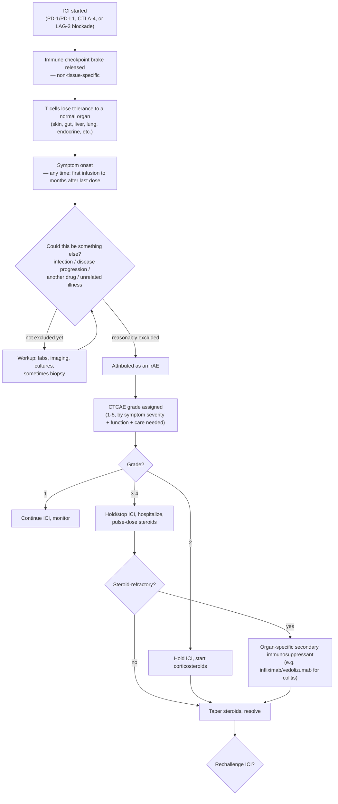
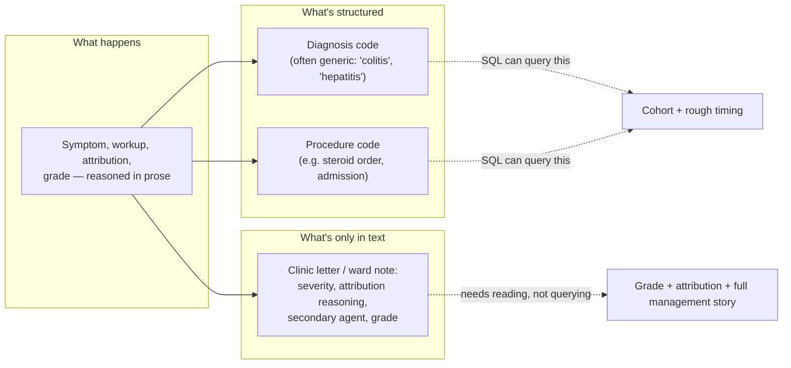
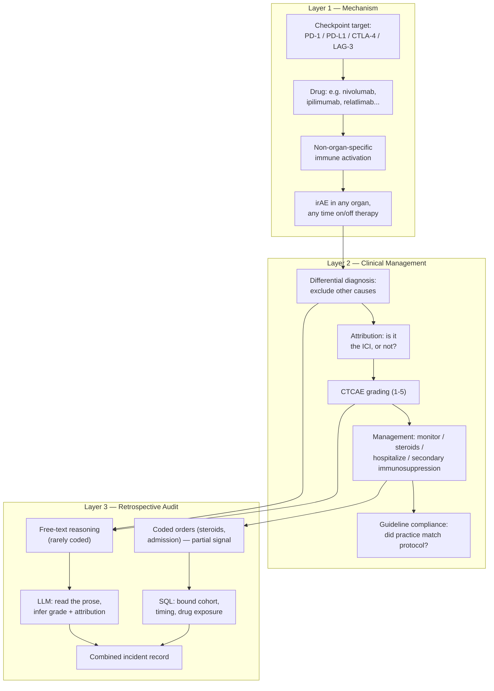

# Learning Map — Detecting and Grading Immune Checkpoint Inhibitor Toxicity

A mental model for why "find every immune checkpoint inhibitor toxicity incident and grade its severity" is a judgment task hiding inside what looks like a data-extraction task — built around a real hospital audit request (solid-tumour oncology patients on immunotherapy since 2020), not an oncology textbook.

## Sections

01. [Essence](#01-essence)
02. [World Model](#02-world-model)
03. [Concept Map](#03-concept-map)
04. [Decision Map](#04-decision-map)
05. [Search Space Expansion](#05-search-space-expansion)
06. [Ecosystem](#06-ecosystem)
07. [Transferable Principles](#07-transferable-principles)
08. [Minimum Mental Model](#08-minimum-mental-model)
09. [Common Misconceptions](#09-common-misconceptions)
10. [Summary](#10-summary)

---

## 01. Essence

Immune checkpoint inhibitors (ICIs) — the PD-1/PD-L1 blockers (nivolumab, pembrolizumab, atezolizumab, durvalumab, cemiplimab, avelumab, dostarlimab, balstilimab), CTLA-4 blockers (ipilimumab, tremelimumab, botensilimab), and the newer LAG-3 blocker (relatlimab) — work by releasing brakes the immune system normally applies to itself, so T cells that a tumour has learned to suppress can attack it again. That mechanism is deliberately non-specific: the brakes being released aren't tumour-specific, they're the general brakes the immune system uses everywhere, on every tissue, all the time. Before ICIs, most cancer-treatment toxicity was direct cytotoxic damage — a chemotherapy drug poisoning fast-dividing cells, with a fairly predictable dose-response and timing curve. ICI toxicity is a different animal: it's the reactivated immune system attacking healthy tissue it happens to have lost tolerance for, in any organ, at any point from the first dose to many months after the last one, and looking clinically like a dozen other more common diseases along the way.

This is why these are called immune-**related** adverse events (irAEs) rather than side effects — they're not off-target drug toxicity in the pharmacological sense, they're autoimmune disease triggered by the treatment. And it's why grading one is fundamentally different from grading, say, chemotherapy-induced neutropenia. Neutropenia is a lab value: the neutrophil count is 0.4, that's Grade 3, done. An irAE's severity (CTCAE Grade 1 through 5) usually depends on a clinician's synthesis of symptom severity, how much it interferes with daily activities, whether hospitalization was needed, and — critically — whether alternative causes (infection, disease progression, another drug) were considered and reasonably excluded first. That synthesis happens in prose, in a clinic letter or ward round note. It very rarely gets typed back out as a discrete, queryable field.

The data request this map is built for asks a hospital's data system to do exactly what a coded record was never designed to do: at scale, across every patient started on any of twelve-plus ICI drugs since January 2020, find every toxicity incident, know how severe each one was, and describe how it was managed — including the secondary immunosuppressants used when steroids alone weren't enough. A pure SQL query over diagnosis and procedure codes can bound *who* was on an ICI and roughly *when* something happened to them. It cannot tell you that the diarrhea documented in March was Grade 2 immune-mediated colitis attributed to ipilimumab after infection was ruled out, rather than Grade 1 self-limiting loose stools or an unrelated norovirus. That distinction is why this request pairs SQL with an LLM arm, and why its own author flags "toxicity incident detection and grading" as the hardest item on the list — and notes it's the same shape of problem, and the same workaround, as an earlier, narrower request into steroid complications and colitis.

## 02. World Model

The chain of events runs from a released immune brake, through a clinical decision that has to actively rule things out before it can rule an irAE in, to a graded, managed, and (usually, eventually) resolved episode — and a parallel, much thinner chain runs from that same episode into whatever a hospital's structured record actually captures.

A second, thinner chain runs alongside this one — the one an audit actually has access to:

The actors: the **patient**, the **specific ICI drug(s)** they're on (mechanism and typical toxicity profile differ meaningfully between anti-PD-1/PD-L1 and anti-CTLA-4, and combinations compound risk), the **target organ** (skin, GI tract, liver, lungs, endocrine glands, kidneys, joints, nervous system, heart — almost anything is eligible), the **treating clinician** making the attribution-and-grading judgment, the **coded record** (diagnosis/procedure codes — this request's "Clinical codes given"), and the **free-text note** — the only place the actual severity/attribution reasoning and secondary-immunosuppressant story reliably live.

## 03. Concept Map

Three layers: why toxicity happens at all, how a clinician manages it once it does, and how an audit tries to reconstruct that management retrospectively from a mixed structured/unstructured record.

Layer 1 is fixed immunology — the mechanism doesn't change per patient. Layer 2 is where every judgment call in this whole domain actually lives: a clinician deciding *is this the drug, and how bad is it*. Layer 3 is the layer this data request sits in, and it inherits Layer 2's judgment problem wholesale — an audit can't grade what the clinician graded any more definitively than SQL alone can read a paragraph. It can only try to recover that judgment from wherever it was written down, which is why the LLM arm exists at all: it's not adding intelligence SQL lacks, it's reading text SQL was never built to read.

## 04. Decision Map

**If a symptom appears in a patient on (or recently off) an ICI and could plausibly be immune-related:**
  - **Decision:** Work up alternative causes (infection, disease progression, other concurrent drugs) before attributing it to the ICI
  - **Reason:** irAEs have no unique diagnostic signature in most organs — immune colitis looks like infectious colitis on symptoms alone, immune pneumonitis looks like infectious pneumonia on imaging alone — so attribution is a diagnosis of exclusion, not a positive test result
  - **Expected outcome:** A defensible attribution decision that a chart reviewer (human or LLM) can actually follow, because the reasoning is written down explicitly rather than implied

**If a toxicity is graded CTCAE 1:**
  - **Decision:** Continue the ICI, monitor closely
  - **Reason:** Grade 1 is mild and doesn't yet threaten function or require systemic treatment; stopping a working cancer therapy for a minor, self-limited event trades a real benefit for an unneeded precaution
  - **Expected outcome:** Toxicity resolves or stays stable without treatment interruption

**If a toxicity is graded CTCAE 2:**
  - **Decision:** Hold the ICI and start corticosteroids
  - **Reason:** Moderate symptoms interfering with daily activity warrant active treatment, but full drug discontinuation and hospitalization are usually not yet necessary
  - **Expected outcome:** Symptom control within days to weeks, ICI often resumed once resolved

**If a toxicity is graded CTCAE 3-4:**
  - **Decision:** Hold or permanently stop the ICI, hospitalize, start pulse-dose corticosteroids
  - **Reason:** Severe or life-threatening irAEs carry real morbidity/mortality risk on their own, independent of the cancer being treated — the immediate toxicity has to be brought under control first
  - **Expected outcome:** Inpatient stabilization; a formal decision point on whether/when to rechallenge

**If a Grade 3-4 (or refractory Grade 2) irAE doesn't respond to corticosteroids:**
  - **Decision:** Add an organ-specific secondary immunosuppressant (e.g. infliximab or vedolizumab for steroid-refractory colitis; mycophenolate for hepatitis)
  - **Reason:** Steroids are the first-line brake on the reactivated immune response, but some organ-specific inflammation needs a more targeted agent to control once steroids alone plateau
  - **Expected outcome:** This is exactly the "complications and responses to secondary immunosuppressive agents" the audit's secondary goal asks about — its presence or absence in the record is itself a data point on guideline compliance

**If a data-extraction pipeline only has diagnosis/procedure codes to work with:**
  - **Decision:** Use SQL to bound the cohort (who was on which ICI, roughly when) but do not trust codes alone to supply grade or attribution
  - **Reason:** Codes here are "Diagnosis Codes" and "Procedure Codes" — categorical and administrative by design, not built to carry a 1-5 severity scale or a documented causality judgment
  - **Expected outcome:** A correctly bounded population, with the actual severity/attribution question deferred to the next step rather than guessed from a code alone

**If the exact incident and grade aren't reliably coded, but a proxy signal is:**
  - **Decision:** Use corticosteroid initiation, secondary-immunosuppressant orders, ICI discontinuation, or hospitalization as detection proxies, then have the LLM read the surrounding notes to confirm grade and attribution
  - **Reason:** This is the "same proxy workaround" the request explicitly references from an earlier, narrower steroid-complications query — a treatment escalation is a much stronger, more consistently-recorded signal that *something* happened than a diagnosis code is, even though the escalation alone doesn't say how severe or which organ
  - **Expected outcome:** Higher-recall incident detection than diagnosis codes alone would give, at the cost of needing the LLM step to disambiguate proxy-triggered false positives (steroids started for an unrelated reason, admission unrelated to toxicity)

## 05. Search Space Expansion

**Rarely asked, worth asking:** Why is an irAE called a *disease trigger* rather than a *side effect* — and does that framing change how aggressively it should be treated compared to a chemotherapy toxicity? Do patients who develop irAEs actually respond better to the ICI itself (the "if it's working on your immune system, is it also working on the tumour" question) — and if so, should that change how eagerly a clinician stops therapy at Grade 2?

**What experts actually argue about:** How much should corticosteroids for irAE management be feared to blunt the ICI's own antitumour effect — is that a real tradeoff or a mostly-theoretical one? When is a steroid-refractory irAE truly refractory versus just undertreated (wrong dose, too-short pulse)? How reliable is LLM-extracted CTCAE grading against double-abstracted human chart review, and what's an acceptable disagreement rate for an audit versus a safety-signal system?

**Where this could go next:** Real-time toxicity-detection triggers built into the EHR instead of retrospective audit (catching Grade 2→3 progression as it's being written, not months later); prospective biomarkers that flag which patients are at elevated irAE risk before the first dose; standardizing free-text documentation itself (structured irAE templates) so retrospective extraction stops needing to be this hard in the first place.

**What mastery looks like:** Designing an extraction pipeline honest about its own miss rate — knowing which incidents SQL-plus-proxy-signals will systematically undercount (irAEs managed without steroid escalation, or managed at another site with no crossover record), rather than reporting a count as if it were a complete enumeration.

## 06. Ecosystem

**Upstream:** the solid-tumour oncology diagnosis and eligibility decision that put the patient on an ICI in the first place; the specific drug/combination chosen (single-agent PD-1 blockade carries meaningfully lower toxicity risk than PD-1/CTLA-4 combinations); two related, narrower prior audits this request explicitly builds on — a steroid-complications query and a GI/colitis-specific toxicity audit — both of which established the same proxy-signal workaround this broader request reuses.

**Downstream:** institutional guideline-compliance reporting (did management actually follow protocol); pharmacovigilance signal reporting to regulators; any future prospective toxicity-prediction or real-time-alerting tool that would need this kind of retrospective incidence/severity baseline to be built on.

**Adjacent domains that share the same core problem:** CAR T-cell therapy's cytokine release syndrome (CRS) and neurotoxicity (ICANS) grading — same "severity graded from prose, not a lab value" shape; general pharmacovigilance/adverse-drug-event detection from EHR text; any retrospective clinical audit where the outcome of interest is a clinical judgment (attribution, severity, guideline adherence) rather than a lab result or a diagnosis code.

**No real substitute for the free-text read:** as long as attribution and grading are reasoned in prose by a clinician rather than entered into a structured severity field, some form of text understanding — LLM-assisted or manual chart review — is not a nice-to-have alongside SQL, it's the only route to the actual answer.

## 07. Transferable Principles

**First principle**
  - Releasing an immune brake broadly, rather than narrowly at the tumour, means the resulting toxicity can appear in any organ system, on any timeline — this single mechanistic fact is why irAEs can't be predicted or bounded the way organ-specific drug toxicity can

**Methodology**
  - Diagnosis of exclusion before attribution: rule out infection, progression, and other drug causes before crediting an effect to the treatment under study — this causality-assessment discipline applies to any adverse-event judgment, not just irAEs
  - Pair structured querying with narrative-reading for any outcome that's fundamentally a judgment call: SQL bounds *who* and roughly *when*; free-text reading (LLM or human) answers *how severe* and *was it really this*
  - Use treatment-escalation events (steroid start, drug discontinuation, admission) as higher-recall detection proxies when the outcome itself isn't reliably coded — accepting the tradeoff that proxies overcapture and need a disambiguation step afterward

**Implementation detail**
  - The exact CTCAE version and its numeric grade thresholds per organ
  - The specific list of ICI drugs and which checkpoint each targets
  - The specific secondary immunosuppressant chosen per organ (infliximab vs vedolizumab vs mycophenolate, etc.)

**Stable knowledge**
  - T-cell checkpoint biology and why blocking it is non-organ-specific
  - The general shape of the causality-assessment problem (exclude alternatives, then attribute)

**Likely to change**
  - The roster of approved ICI agents and targets (LAG-3 blockade is recent; further novel targets and Fc-enhanced agents like botensilimab are still emerging)
  - How much of this extraction task LLMs can eventually do reliably enough to replace, rather than merely assist, structured proxy-signal workarounds

## 08. Minimum Mental Model

- **Immune checkpoint** — a brake the immune system applies to itself; ICIs release it.
- **PD-1 / PD-L1 / CTLA-4 / LAG-3** — the four checkpoint targets in current clinical use.
- **irAE (immune-related adverse event)** — autoimmune-type toxicity from a released brake, not classic drug poisoning.
- **Non-organ-specificity** — the reason irAEs can appear anywhere, unlike most drug toxicity.
- **Onset timing variability** — irAEs can start at first dose or months after the last one.
- **Attribution (causality assessment)** — deciding it's the ICI, only after excluding other causes.
- **CTCAE grade (1-5)** — the severity scale, assigned by clinical judgment, not a lab cutoff.
- **Steroid-refractory** — when corticosteroids alone don't control the irAE.
- **Secondary immunosuppression** — the organ-specific escalation agent used after steroids fail.
- **Rechallenge decision** — whether/when to restart the ICI after an irAE resolves.
- **Diagnosis/procedure code** — the structured, categorical, severity-blind part of the record.
- **Free-text clinical note** — where attribution reasoning and grade actually live.
- **Detection proxy** — a treatment-escalation event (steroids, discontinuation, admission) standing in for a hard-to-code outcome.
- **SQL's role** — cohort and timing bounding, not judgment.
- **LLM's role** — reading prose to recover grade, attribution, and management detail.
- **Guideline compliance audit** — measuring whether actual management matched protocol.

## 09. Common Misconceptions

**"irAEs are rare, so this is a small, edge-case audit."**
*Why it's tempting:* "Adverse event" sounds like the unusual outcome, and severe, hospitalization-level irAEs genuinely are a minority of cases.
→ Some degree of irAE occurs in a substantial share of ICI-treated patients — often most patients on combination regimens — with the majority mild (Grade 1-2). The audit's population is closer to "most patients on immunotherapy" than to a rare subgroup; only the severe tail is small.

**"A diagnosis code for colitis/hepatitis/pneumonitis means a documented, graded incident exists."**
*Why it's tempting:* A code looks like a discrete, complete data point — it was entered by someone, for a reason.
→ A code flags a category, not a severity or a cause. The same code covers Grade 1 self-limiting symptoms and Grade 4 organ failure, and covers immune-mediated cases alongside infectious or unrelated ones with the identical code. The grading and attribution live in the prose, if anywhere.

**"Steroid initiation or hospitalization is a reliable stand-in for 'severe irAE happened.'"**
*Why it's tempting:* It's the same proxy the earlier steroid-complications and colitis audits already used successfully, so it reads as a validated shortcut.
→ It's a useful *detection* signal (higher recall than codes alone), not a *confirmation* signal — steroids get started for unrelated reasons, and hospitalization can be for disease progression or something else entirely. The proxy narrows where to look; it doesn't replace reading the note to confirm what actually happened.

**"Once a patient stops the ICI, the toxicity risk is over."**
*Why it's tempting:* It mirrors how most drug toxicity works — stop the drug, the effect fades.
→ Because the mechanism is a reactivated, self-sustaining immune response rather than ongoing drug exposure, irAEs can first appear — or persist — months after the last dose, which is exactly why this audit's timing question (an "event with timing" annotation pattern) can't just look at the on-treatment window.

**"Having an LLM grade toxicity is automating a checklist a person could do faster by hand."**
*Why it's tempting:* CTCAE grades look like a lookup table — match symptom to grade.
→ The hard part isn't the lookup table, it's the same judgment a clinician makes: excluding alternative causes and weighing severity from a narrative description. Oncologists themselves show real inter-rater disagreement on grading and attribution — the task is genuinely a judgment call, which is exactly why the request needed an LLM arm instead of a rules-based classifier.

## 10. Summary

What I truly gain is not *a list of diagnosis codes that mark ICI toxicity*, but *a model of why "detect and grade a toxicity incident" is a clinical judgment task recorded in prose — one that excludes alternative causes before attributing an event to the drug, and assigns severity by synthesis rather than lookup — and why a data pipeline built to answer it has to pair SQL (for bounding who and roughly when) with an LLM reading the actual notes (for the attribution and severity a code was never designed to carry), using treatment-escalation proxies to find the incidents worth reading in the first place.*

---

*Learning Map — deliberately skips the exact CTCAE grading tables, specific corticosteroid dosing regimens, and step-by-step query syntax. For operational detail, see the source data request, its attached code list, and institutional immunotherapy toxicity management guidelines directly.*
