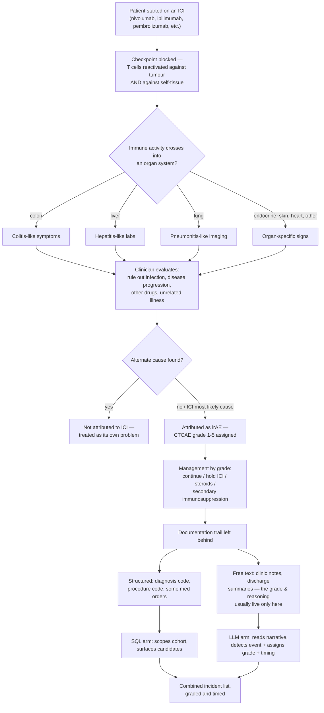
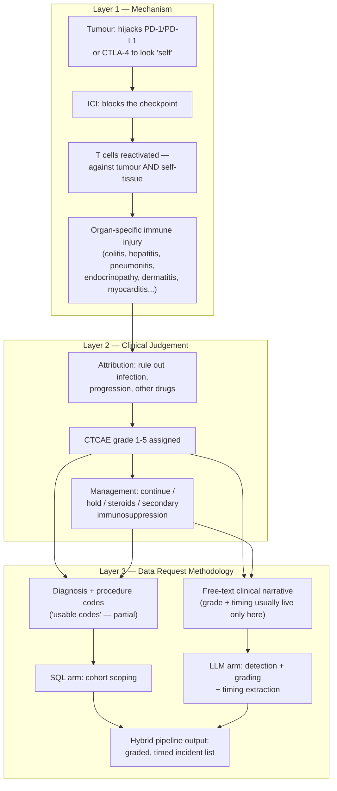

# Learning Map — ICI Toxicity Incident Detection & Grading via a Hybrid SQL+LLM Data Request

A mental model for why a clinical data-analytics team can't answer "find and grade every Immune Checkpoint Inhibitor toxicity incident in our solid-tumour oncology patients" with a SQL query alone — built around a real data request (Request 22, Requester 003), not a coding tutorial.

## Sections

01. [Essence](#01-essence)
02. [World Model](#02-world-model)
03. [Concept Map](#03-concept-map)
04. [Decision Map](#04-decision-map)
05. [Search Space Expansion](#05-search-space-expansion)
06. [Ecosystem](#06-ecosystem)
07. [Transferable Principles](#07-transferable-principles)
08. [Minimum Mental Model](#08-minimum-mental-model)
09. [Common Misconceptions](#09-common-misconceptions)
10. [Summary](#10-summary)

---

## 01. Essence

Immune Checkpoint Inhibitors (ICIs — nivolumab, ipilimumab, pembrolizumab, atezolizumab, and a growing list of others) treat cancer by releasing a brake the immune system normally holds on itself. Tumours often survive by hijacking checkpoint proteins (PD-1/PD-L1, CTLA-4) to look "self" to the immune system and avoid attack. An ICI blocks that hijack, so T cells can recognize and kill the tumour again. The problem: those same brakes exist because the immune system needs *some* restraint against attacking the body's own healthy tissue. Remove the brake system-wide, for cancer's sake, and the immune system doesn't just resume attacking the tumour — it can start attacking the colon, the liver, the lungs, the thyroid, the skin, the heart, almost any organ, in almost any patient, at almost any point in treatment. This is called an **immune-related adverse event (irAE)**.

Before ICIs, oncology toxicity was mostly dose-related and mechanistic: give a cytotoxic chemotherapy drug, expect bone-marrow suppression roughly on schedule, in rough proportion to dose. irAEs break that pattern completely. They're autoimmune-*like*, not dose-dependent in any clean way, can start weeks or months after the last infusion, can hit an organ never affected before in that patient, and — critically for this data request — **look, on paper, exactly like a dozen other things that aren't ICI toxicity at all**: an infection, the cancer progressing, a different drug's side effect, or an unrelated pre-existing condition. Deciding "yes, this is an irAE, and it's this severe" is a clinical judgement call that weighs all of that context together. It is not a lab value crossing a line.

This data request exists because a clinical team wants to audit that judgement call at population scale — across every solid-tumour patient started on an ICI since 2020 — to see what toxicity actually happened, how it was managed, and whether care matched guidelines. A pure SQL query over diagnosis and procedure codes can find *candidates* (a colitis code, a pneumonitis code, a steroid order) but cannot itself perform the judgement — determine attribution, assign a CTCAE grade, or place the event in time relative to treatment. That's why this request requires **both** methods: SQL to scope the population and surface structured signal, and an **LLM arm** to read the clinical narrative and approximate the same judgement the treating oncologist made at the bedside. The new possibility this combination opens isn't "find every irAE with 100% certainty" — nothing does that reliably yet — it's finding and grading toxicity at a scale full manual chart review can't reach, without silently reducing "detect and grade" down to "count a code that happens to correlate."

## 02. World Model

Three things happen in sequence for every patient in this cohort, on two very different clocks — the clinical clock (what actually happens to the patient) and the documentation clock (what of that ever becomes queryable data, and in what form).

**Objects in play:** the **ICI** (the drug class, several agents, each with its own toxicity profile and combination regimens like nivolumab+ipilimumab carrying higher risk than either alone), the **irAE** (the toxicity event itself — an organ-specific, immune-mediated injury), the **attribution judgement** (the clinician's reasoning that rules out non-ICI causes before calling something an irAE), the **CTCAE grade** (1 through 5, the standardized severity scale the judgement gets translated into), the **management pathway** (what happens next — hold the drug, start steroids, escalate to a second-line immunosuppressant), and — specific to this data request — the **usable code** (a diagnosis or procedure code the requester supplied that the analytics team can actually build a query against) versus the **documentation trail** (everything that actually got written down, only part of which becomes a usable code).

**Actors:** the **requesting clinical team** (wants the audit — incidence, patterns, management, guideline compliance), the **data-analytics team** (builds and runs the hybrid pipeline), the **SQL arm** (fast, structured, coarse — good at *who's in the cohort*, weak at *what exactly happened and how severe*), and the **LLM arm** (slower, reads free text, approximates the judgement call — good at *what happened and how severe*, only as good as the notes it's given and never fully certain).

**State changes:** a patient moves from *on ICI, no known toxicity* → *candidate flagged* (a code or note fragment suggests something happened) → *adjudicated* (attributed as irAE or ruled out) → *graded and timed* (a CTCAE grade with an onset date attached, because the request's annotation pattern is explicitly "event with timing," not just "did this happen, yes or no"). A request itself moves from *intake* → either **fully SQL-resolvable** (rare, when the answer is a plain structured count), **hybrid SQL+LLM** (this request — most toxicity/judgement questions), or **descoped to manual review** (abandoned as automatable and handed to a human to chart-review case by case, which this request explicitly avoids: "Descoped to manual review? No").

## 03. Concept Map

The domain splits into three layers: the biology that makes irAEs happen, the clinical judgement that turns a symptom into a graded event, and the data-methodology layer this request actually lives in.

- **Layer 1 (Mechanism)** is fixed biology — why irAEs happen at all, and why they can hit any organ. It doesn't change per data request.
- **Layer 2 (Clinical Judgement)** is where the actual difficulty this request names as "hardest item" lives: attribution and grading are reasoning steps a clinician performs by weighing evidence, not a threshold on a single value.
- **Layer 3 (Data Request Methodology)** is the layer this request sits in — it doesn't change Layer 2's judgement, it tries to *reconstruct* it at scale from whatever trail that judgement left behind, using SQL where the trail is structured and an LLM where it isn't.

## 04. Decision Map

**If the requester's clinical/diagnosis codes are marked "usable? Partial":**

- **Decision:** Use the supplied codes to scope and pre-filter the cohort (who's on an ICI, who has a plausible toxicity-adjacent diagnosis or procedure code), not to answer the detection-and-grading question itself
- **Reason:** "Partial" means the codes narrow the search space honestly but don't carry the grade or the attribution reasoning — treating them as the final answer would silently convert "candidate" into "confirmed graded incident"
- **Expected outcome:** A manageable candidate list for the LLM arm to actually adjudicate, instead of either an unfiltered flood of notes or a falsely-confident code-only count

**If the hardest item on the request is toxicity detection and grading:**

- **Decision:** Route this specific sub-task to the LLM arm reading clinical narrative, not to a SQL rule over structured fields
- **Reason:** Grading requires the same reasoning a clinician does — weighing symptoms, ruling out alternate causes, matching severity to CTCAE criteria — which mostly exists only as prose in notes and discharge summaries, not as a field with a value
- **Expected outcome:** Incident-level grades that reflect actual clinical reasoning, at population scale, instead of a proxy count of how many patients happen to have a matching diagnosis code

**If the task looks too judgement-heavy to automate confidently:**

- **Decision:** Keep it in the hybrid SQL+LLM pipeline rather than descoping it to full manual chart review (per this request: "Descoped to manual review? No")
- **Reason:** Manual review of every chart in a multi-year, multi-drug solid-tumour ICI cohort doesn't scale to the project's timeline; the LLM arm exists specifically to approximate the judgement call at a volume manual review can't reach
- **Expected outcome:** A complete, if imperfect, graded incident list across the whole cohort — with the understanding that low-confidence LLM outputs may still need a smaller, targeted manual check, rather than reviewing everything by hand

**If a similar request has already been solved for a narrower scope (e.g. the steroid-complications query, the ICI colitis audit):**

- **Decision:** Reuse that prior query's cohort logic, code list, and LLM prompt/extraction pattern as a starting proxy, rather than designing detection-and-grading from scratch
- **Reason:** This request is explicitly "the same shape as ID 3... a broader restatement... same proxy workaround" — the underlying problem (structured codes can't carry a judgement call) and its workaround (LLM reads the narrative) don't change just because the scope got broader
- **Expected outcome:** Faster, more consistent build, and a track record of what worked (or didn't) on the narrower prior queries to calibrate expectations on this one

**If the annotation pattern is "event with timing," not a simple yes/no flag:**

- **Decision:** Have the LLM arm extract an onset date (or best-estimate window) alongside the grade for every detected incident, not just presence/absence
- **Reason:** The secondary goal — describing management, compliance, and improvement areas — depends on knowing *when* an incident happened relative to ICI start/cycle number and relative to when steroids or other treatment began; a flag with no timestamp can't answer any of those follow-on questions
- **Expected outcome:** A dataset that supports a timeline view per patient (ICI start → toxicity onset → management steps), not just an incidence count

**If the LLM arm's confidence on a given note is low (ambiguous language, incomplete documentation):**

- **Decision:** Flag the case for a smaller, targeted human check rather than forcing a grade out of the model or silently dropping the case
- **Reason:** A forced low-confidence grade pollutes the incidence/severity statistics the requester actually needs; silently dropping the case biases the count downward in a way nobody can see later
- **Expected outcome:** A dataset that's honest about its own uncertainty, with the genuinely hard cases routed to the one place (limited human review) that scales to a handful of cases even though it can't scale to the whole cohort

## 05. Search Space Expansion

**Beginner questions rarely asked**
What does it actually mean for the immune system to "not recognize self" versus "recognize but be held back from attacking self" — and which of those is a checkpoint actually doing? Why does one patient get colitis and another gets a thyroid problem, from the same drug?

**What experts actually argue about**
How much do different oncologists disagree when independently grading the same irAE case (inter-rater reliability), and does that disagreement set a ceiling on how accurate an LLM arm can realistically be, since it's being trained/evaluated against a not-fully-consistent human standard? Should CTCAE — designed originally for chemotherapy toxicity — even be the grading system for an immune-mediated event that behaves so differently in kind?

**Questions worth exploring next**
How well does the LLM arm's assigned grade and attribution agree with what the treating oncologist actually documented, when checked against a sample? What's the right confidence threshold below which a case should be routed to manual review instead of trusted, and does that threshold need to be different per organ system (e.g. myocarditis grading errors are far costlier than dermatitis ones)?

**What mastery of this domain looks like**
Being able to look at a data request and immediately see which parts are a structured-data lookup, which parts require narrative judgement, and which parts sit exactly on that boundary (like grading) where a hybrid approach — not a bigger SQL query, not full manual review — is the only method that fits. Recognizing when a "usable code" is being asked to answer a question it was never designed to carry.

## 06. Ecosystem

**Upstream:** the cancer diagnosis and staging that made an ICI the chosen treatment; the specific regimen (single-agent PD-1/PD-L1 blockade vs. combination with a CTLA-4 agent like ipilimumab, which raises toxicity risk substantially); the institution's clinical documentation habits, which determine how much of the grading reasoning ever makes it into a note the LLM arm can actually read.

**Downstream:** the secondary goal of this request — describing management (steroids, secondary immunosuppressive agents like infliximab or other biologics), assessing guideline compliance (ASCO/SITC/ESMO irAE management guidelines), and identifying care-improvement areas; ultimately a quality-improvement or audit report back to the requesting clinical team.

**Directly related prior work (not background reading, active reuse):** the IO toxicity steroid-complications query and the ICI colitis audit query this request explicitly builds upon — narrower-scope predecessors that already solved the same core problem (structured codes can't carry the judgement call) for one organ system or one management arm, and whose query/extraction logic is the "proxy workaround" this broader request reuses rather than reinvents.

**Adjacent domains that share the same shape:** CAR T-cell therapy's cytokine release syndrome (CRS) and neurotoxicity (ICANS) grading — another oncology toxicity that's graded by clinical judgement on a structured scale, not a lab cutoff; general adverse-drug-event pharmacovigilance NLP, which faces the identical structured-vs-narrative gap for drug safety signals generally; any retrospective hospital audit where the outcome of interest is itself a judgement call (e.g. "was this readmission preventable") rather than an objectively coded fact.

**No real substitute:** for detecting and grading a judgement-based clinical event at this scale, there isn't a third method waiting in the wings — it's SQL-only (too shallow, misses attribution/grading entirely), full manual review (accurate but doesn't scale to a multi-year, multi-drug cohort), or the hybrid SQL+LLM approach this request chose specifically to sit between those two failure modes.

## 07. Transferable Principles

**First principle**
  - A diagnosis or procedure code records that *something in that category happened*; it does not record *why it happened, how severe it was, or whether this specific cause is the right one* — those are judgement outputs, not data-entry outputs.
  - Any toxicity or outcome whose definition includes ruling out alternate explanations is, by construction, not fully SQL-answerable.

**Methodology**
  - Use structured codes to scope a candidate population (fast, coarse, "usable" but partial), and use narrative-reading (LLM or human) to resolve the judgement call within that population (slow, precise, where the real signal lives).
  - Treat "descope to manual review" as a last resort reserved for what the hybrid pipeline genuinely can't resolve confidently — not a default response to a hard-looking task.
  - Reuse a narrower, already-solved instance of the same problem shape (a prior query, a prior extraction pattern) as a proxy/starting point before building a broader version from scratch.
  - When a request's annotation pattern requires timing, extract a timestamp alongside every detected event — a presence/absence flag alone can't support any follow-on timeline analysis.

**Implementation detail**
  - Today's concrete form: the specific list of ICI drugs (nivolumab, ipilimumab, pembrolizumab, etc.), the specific diagnosis/procedure codes supplied, the specific CTCAE version and grade thresholds in use, and the specific LLM prompt/extraction schema built for this request.

**Stable knowledge**
  - The mechanistic fact that checkpoint blockade removes a restraint the immune system needs against attacking healthy tissue, which is why toxicity can appear in nearly any organ, on a delayed and unpredictable schedule.
  - The structural fact that clinical judgement calls (attribution, severity grading) live in narrative documentation, not in structured fields, regardless of which EHR or coding system a given hospital uses.

**Likely to change**
  - The exact confidence threshold and workflow for routing a low-confidence LLM case to manual review, as extraction accuracy improves over time.
  - The list of approved ICI drugs and combination regimens, which keeps growing as new agents (e.g. relatlimab, botensilimab) reach practice.
  - CTCAE grading criteria themselves, which get revised as understanding of irAE severity evolves.

## 08. Minimum Mental Model

- **Immune Checkpoint Inhibitor (ICI)** — a drug that blocks a brake (PD-1/PD-L1, CTLA-4) the immune system uses to avoid attacking "self," freeing it to attack tumour too.
- **irAE (immune-related adverse event)** — the toxicity that results when that freed immune activity attacks healthy tissue instead of, or alongside, the tumour.
- **Attribution** — the clinical reasoning step that rules out infection, disease progression, and other drugs before calling an event an irAE.
- **CTCAE grade** — the standardized 1–5 severity scale an irAE gets assigned to, once attributed.
- **Organ specificity** — irAEs can hit almost any organ (colitis, hepatitis, pneumonitis, endocrinopathy, dermatitis, myocarditis), each graded by its own criteria.
- **Onset timing** — when an irAE occurred relative to ICI start/cycle, which this request's "event with timing" annotation pattern requires capturing, not just whether it happened.
- **Usable code** — a diagnosis/procedure code the requester supplied that the data team can actually build a structured query against; "partial" means it scopes, but doesn't resolve, the harder question.
- **SQL arm** — the structured-data half of the pipeline: fast, coarse, good for cohort scoping.
- **LLM arm** — the narrative-reading half of the pipeline: slower, approximates the clinician's judgement call for detection, grading, and timing.
- **Hybrid SQL+LLM pipeline** — the combination this request requires because neither method alone can answer a judgement-based question at scale.
- **Descoped to manual review** — the fallback of handing a task to a human chart-reviewer case by case; this request deliberately avoids that fallback.
- **Proxy workaround** — reusing a narrower prior query's logic as the template for a broader one facing the same underlying problem.
- **Secondary immunosuppression** — escalated treatment (e.g. beyond steroids, to biologics like infliximab) for irAEs that don't resolve with first-line management; part of what the request's secondary goal audits.

## 09. Common Misconceptions

**"An irAE is just a normal chemo-style side effect, only from a different drug class."**
*Why it happens:* it's discussed alongside other cancer-treatment toxicities in the same clinic, same charts, same general vocabulary.
→ irAEs are immune-mediated, not dose-mechanistic — they can appear months after the last dose, in an organ never affected before, and require ruling out unrelated causes before they're even confirmed; a chemo side effect rarely needs that same investigative step.

**"A diagnosis code for colitis (or hepatitis, or pneumonitis) in an ICI patient means it's an irAE."**
*Why it happens:* the code and the drug co-occur in the same patient record, which reads as a link.
→ The code only says the organ problem was diagnosed — it says nothing about whether the ICI, an infection, disease progression, or another drug caused it. That attribution step is exactly what "usable codes: partial" acknowledges the codes can't carry.

**"If we have the diagnosis and procedure codes, SQL can find and grade these incidents."**
*Why it happens:* SQL is genuinely the right, sufficient tool for most cohort-definition questions in this same dataset, so it's natural to assume it scales to this one too.
→ Grading requires weighing evidence and excluding alternatives — a reasoning process that mostly exists only as prose in clinical notes, not as a field with a value SQL can filter on. That gap is precisely why this request requires an LLM arm.

**"Descoping something to manual review is the safe, careful choice when a task looks hard."**
*Why it happens:* manual human review feels inherently more trustworthy than an automated pipeline, especially for something as high-stakes as toxicity grading.
→ For a cohort this size, manual review doesn't scale to the project's timeline at all — "descoped to manual review" isn't a safety upgrade, it's effectively "this task doesn't get done" at full scope. The hybrid pipeline exists specifically so the harder task stays answerable, with manual review reserved for the smaller set of genuinely low-confidence cases.

**"This request is a brand-new problem the data team has to solve from scratch."**
*Why it happens:* the request reads as its own self-contained ask, with its own inclusion criteria and drug list.
→ It explicitly builds on and restates two prior, narrower queries (the steroid-complications query and the ICI colitis audit) — the underlying problem and its SQL+LLM workaround are already proven at smaller scope; this request broadens rather than reinvents them.

## 10. Summary

What I truly gain is not *a code that flags "toxicity happened,"* but *a model of how a subjective, evidence-weighing clinical judgement — attribution and severity grading — gets approximated at population scale by pairing SQL's speed at scoping a cohort with an LLM's ability to read the same narrative signals a clinician reasoned over, and the discipline to know that some data requests can't be answered by structured codes alone, no matter how complete the code list looks.*

---

*Learning Map — deliberately skips the exact SQL query text, the specific LLM prompt/extraction schema, and CTCAE's full criteria tables. For operational detail (the attached code list, the exact data-item specification), see the source data request directly.*
