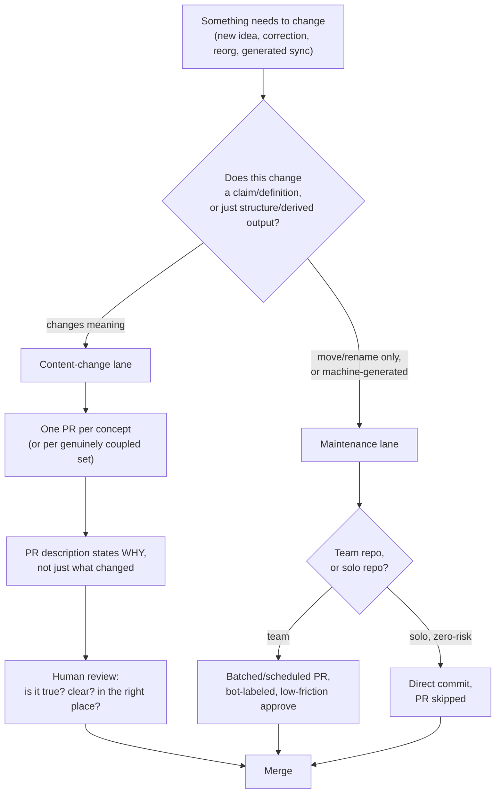
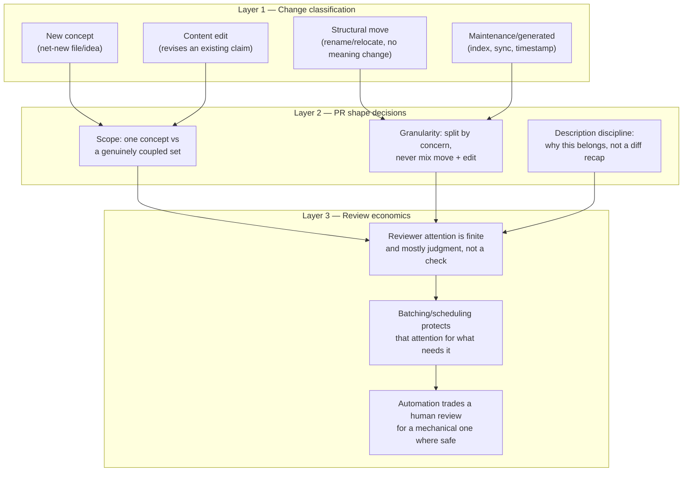
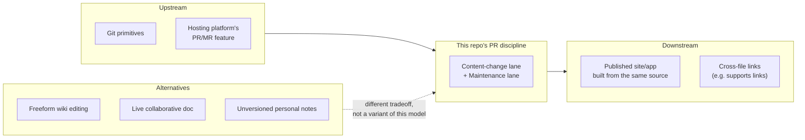

# Learning Map — PR Discipline in a Non-Coding (Markdown Concept) Repository

A mental model for organizing pull requests when the repository's "product" is Markdown
concept documents — a research/knowledge base, a personal wiki, a folder of Learning
Maps — rather than executable code, plus how recurring maintenance work (index syncs,
generated-file updates, housekeeping) should be scoped into or out of that same PR
discipline.

## Sections

01. [Essence](#01-essence)
02. [World Model](#02-world-model)
03. [Concept Map](#03-concept-map)
04. [Decision Map](#04-decision-map)
05. [Search Space Expansion](#05-search-space-expansion)
06. [Ecosystem](#06-ecosystem)
07. [Transferable Principles](#07-transferable-principles)
08. [Minimum Mental Model](#08-minimum-mental-model)
09. [Common Misconceptions](#09-common-misconceptions)
10. [Summary](#10-summary)

---

## 01. Essence

A pull request exists, historically, to solve one problem: in a codebase with an
executable artifact and multiple contributors, a bad change is *measurable* (it fails
to compile, breaks a test, crashes at runtime), and the PR is the checkpoint where that
measurable risk gets caught before it reaches everyone else's copy. The PR bundles a
diff, a stated intent, and a discussion thread, and gates all three behind a merge
button someone has to press on purpose.

A Markdown concept repository has no compiler. A wrong idea, an out-of-date definition,
or a link that now points at a renamed file doesn't throw an error — it just sits there,
quietly wrong, until a reader trips over it. So the naive conclusion is "PRs don't
apply here, there's nothing to gate." That's wrong, but understanding *why* it's wrong
is the whole point of this map: PR infrastructure gives four things that have nothing
to do with compilation —

- a **reviewable diff format**, so a reader can see exactly what changed instead of
  re-reading the whole file
- a **paper trail of why**, captured in the PR description and discussion, not just
  what
- a **rollback point**, so a bad edit (a wrong claim, a broken restructure) is one
  revert away
- a **unit boundary**, forcing an answer to "what counts as one change" — which turns
  out to be the load-bearing question, because a concept repo's real risk isn't
  runtime failure, it's **coherence drift**: a definition edited in one place but not
  its callers, a file moved without its links updated, a concept split into two without
  either half saying so.

Before Git/PR tooling, personal notes were edited in place with no proposal step at
all, and team wikis (MediaWiki, Confluence-style) kept a revision history but no
"propose, then discuss, then decide" structure — edits went live immediately and
disagreement happened *after* the fact, in a talk page, not before merge. What PR
tooling makes newly possible for content is **symmetric treatment with code**: the same
diffing, the same line-anchored comments, the same CI hooks (link checkers, markdown
linters), and a history that documents *editorial* reasoning the way commit history
documents *engineering* reasoning — without needing anything to "run."

The categorical difference to hold onto: a code review answers *"will this run
correctly?"* — often partially checkable by machine. A content review answers *"is this
true, is it clear, and does it belong where it's being put?"* — a judgment call a
machine can't make. That difference is what should shape every PR-organizing decision
below, not the code-repo conventions inherited by default because the tooling happens
to be the same.

## 02. World Model

**Objects in play:** a **change** (an add/edit/delete/move of one or more Markdown
files), a **concept unit** (roughly, one file = one bounded idea — this repo's
`learning-maps/*-learning-map.md`, or a `concepts/*.md` folder), a **structural move**
(rename/relocate with no content edit), a **content edit** (a change to the prose or
claims themselves), a **generated/derived file** (an index, a table of contents, a
synced export, a timestamp — produced by a script, not authored by hand), a **PR**
(the bundle: diff + description + discussion thread), a **commit** (one atomic step
inside that bundle), and a **merge** (folds the branch into main and closes the loop).

**Actors:** the **author** (often the same person as the reviewer, in a personal
knowledge base), a **maintainer/mentor** (an external judgment source in a team or
shared repo — the role a code reviewer plays, but judging coherence, not correctness),
and **automation** (index rebuilders, dead-link checkers, sync scripts — changes with
no human "why" behind them beyond "the source moved").

The value at stake is not uptime — it's **trust in the corpus**: whether a reader (often
the author, months later) can believe a file says what's currently true, sits where
they'd look for it, and wasn't silently contradicted by a change three folders away.
Every convention below is really answering "how do we protect that trust without
paying code-repo review overhead for changes that don't carry code-repo risk."

## 03. Concept Map

Three layers, from what a change *is* down to what a PR *costs* to review.

**New concept** is the highest-value review target — it's the one place a reader's
judgment (is this accurate, is this the right level of abstraction) is irreplaceable.
**Content edit** is second — it changes something someone may already be relying on, so
"what changed and why" matters more than the mechanics of the diff. **Structural move**
is high-diff-noise, low-judgment-needed: the entire review is "did anything besides the
path change" — which is exactly why mixing it with a content edit is expensive (see
Decision Map). **Maintenance/generated** carries the least judgment of all — a script
produced it deterministically from a source of truth, so the review question collapses
to "did the script run correctly," which is a check, not a judgment call.

## 04. Decision Map

**If a change only moves or renames a file, with no edit to its content:**
  - **Decision:** Keep it as its own PR, separate from any content edit
  - **Reason:** A move-only diff is trivially reviewable — confirm nothing but the path
    changed, confirm inbound links were updated. Mixed with a content edit, the reviewer
    has to unpick which lines changed because the file moved (context re-wrapped by the
    tool) versus which lines changed because the *meaning* changed, which multiplies
    review effort for zero benefit
  - **Expected outcome:** Both PRs are fast, close-to-instant reviews instead of one
    slow, error-prone one — this is the exact convention behind seeing a file-move land
    as its own PR

**If you're introducing one new concept:**
  - **Decision:** One concept, one PR
  - **Reason:** The PR's description then answers a single question — "why does this
    concept belong, and is it accurate" — cleanly. A reviewer approving five unrelated
    concepts in one PR is really approving them unread, because there's no way to
    separately accept three and hold two
  - **Expected outcome:** Review quality tracks review effort instead of degrading with
    batch size; a rejected or revised concept doesn't block the other four

**If several concepts are genuinely coupled — e.g. they were all discovered together, or one doesn't make sense without the others' context:**
  - **Decision:** Bundle them into one PR, but say so explicitly in the description
    ("these three are one coherent unit because...")
  - **Reason:** Splitting artificially-coupled concepts costs more reviewer time
    (context reassembled across PRs) than it saves; the discipline that matters is
    *stating the coupling*, not enforcing one-file-per-PR as a hard rule
  - **Expected outcome:** The reviewer evaluates the set as the unit it actually is,
    and the PR history records *why* they were grouped, not just that they were

**If a change is a low-stakes, machine-generated sync — an index rebuild, a table of contents refresh, a timestamp bump, a re-exported derived file:**
  - **Decision:** Route it through a separate maintenance lane — batched daily/on a
    schedule, generated by a script (not hand-edited), and reviewed mechanically
    ("did the script produce what the source implies") rather than for judgment
  - **Reason:** These changes carry no claim a human needs to evaluate — the "review"
    question is deterministic, so treating it like a content review wastes the
    reviewer's scarce judgment budget and, worse, trains them to skim *everything*
    because most PRs in their queue are noise
  - **Expected outcome:** The PR history stays legible — a reader scanning history for
    "what did we decide and why" isn't wading through fifty "sync index" commits to
    find the concept changes that actually mattered

**If daily maintenance commits are piling up and cluttering the log even inside their own lane:**
  - **Decision:** Squash each maintenance PR to a single commit on merge, and/or batch
    multiple routine syncs into one scheduled PR instead of one-PR-per-run
  - **Reason:** The individual steps of a sync (regenerate index, re-check links, bump
    timestamp) have no standalone narrative value — only the end state does. Squashing
    trades away step-by-step granularity nobody will ever read for a history that stays
    scannable
  - **Expected outcome:** `git log` (or the PR list) reads as a story of *decisions*,
    with routine upkeep compressed to a predictable, low-noise cadence

**If you're working solo on a personal knowledge base and a change is truly trivial (fixing a typo, bumping a date) with no other person who could review it:**
  - **Decision:** It's legitimate to commit directly to main, skipping the PR step —
    but keep the commit message discipline (state what and briefly why) even without
    the ceremony
  - **Reason:** A PR's core value — a second person's judgment before a shared branch
    changes — doesn't exist when there is no second person and no execution risk. Only
    the paper-trail and rollback-point benefits remain, and a well-described direct
    commit still gets you both
  - **Expected outcome:** Ceremony scales with actual stakes instead of being paid
    uniformly regardless of who's affected

**If the same "trivial, skip the PR" question comes up in a team or shared repo:**
  - **Decision:** Don't skip the PR — automate it instead (bot-authored, labeled
    `chore`/`maintenance`, auto-merge gated on a passing check) rather than bypassing
    review entirely
  - **Reason:** In a shared repo, "trivial to me" and "trivial to everyone" aren't the
    same claim — the PR is still the mechanism that lets someone else notice and object
    before it's permanent, even if in practice nobody ever does
  - **Expected outcome:** The audit trail and interrupt point survive; only the human
    attention cost is removed

**If a content edit revises a claim someone else's work might depend on (a definition another file's `supports`/link relies on, a shared glossary entry):**
  - **Decision:** Call out the dependency explicitly in the PR description and, where
    the tooling supports it (e.g. this repo's `supports` links), grep for other files
    referencing the changed term before merging
  - **Reason:** Content repos fail silently — nothing errors when a downstream file now
    references a stale definition, so the PR description is the only place that risk
    gets surfaced to a reviewer
  - **Expected outcome:** Coherence drift gets caught at review time instead of being
    discovered by a confused reader later

## 05. Search Space Expansion

**Beginner questions rarely asked:** Does a solo repo need branch protection rules at
all, or is that pure code-repo cargo cult? If there's no CI to gate on, what does
"passing checks" even mean for Markdown? Is a PR description required, or is the diff
self-explanatory for prose?

**Questions experts ask:** How do you keep a maintenance lane's automation from
silently degrading — i.e., who reviews the *script* that regenerates the index, since
its output stops being manually reviewed? At what repo size does "one concept, one PR"
start producing so many small PRs that the overhead itself becomes the noise problem it
was meant to prevent? Should a content repo adopt a lightweight `conventional commits`
style (`concept:`, `edit:`, `chore:`) purely so history/changelog tooling can filter by
type, even without CI needing it?

**Questions worth exploring next:** What does "CI" even mean for prose — a markdown
linter, a dead-link checker, a term-consistency checker (does every `supports` target
actually exist)? Could an LLM reviewer meaningfully fill the "is this true and clear"
role a human mentor plays, or does that just relocate the judgment gap rather than
close it? How does this model change once the repo has multiple authors with unequal
domain expertise — does review become gatekeeping rather than a sanity check?

**Questions that define mastery:** Can you look at a diff and immediately classify it
(new concept / edit / move / maintenance) without being told, and route it to the right
lane by reflex? Can you write a PR description that states *why* a change belongs before
a reviewer has to ask? Can you tell, at a glance, whether a repo's PR history still
tells a legible story of decisions, or has degraded into unreadable noise — and know
which lever (splitting, batching, squashing, automating) fixes which failure mode?

## 06. Ecosystem

**Upstream (what this discipline sits on top of):** Git itself (the diff/branch/commit
primitives), the hosting platform's PR/merge-request feature (GitHub, GitLab, etc.),
and — increasingly — bot/automation accounts that can open and even auto-merge PRs on a
schedule.

**Downstream (what depends on getting this right):** a published docs site or app built
from the same source (e.g. this repo's own `reading-room` app, rendered from
`data.json`, or a static-site generator reading these Markdown files directly), any
generated index/table-of-contents that assumes filenames and paths are stable,
cross-file links (this repo's `supports` links are exactly this) that break silently if
a move isn't tracked.

**Alternatives to this whole model:** a wiki with freeform, un-reviewed live editing
(MediaWiki, Confluence-style) — faster to edit, no proposal step, disagreement handled
after the fact; a live collaborative doc (Notion, Google Docs) — real-time co-editing
with comments, but no diff/rollback discipline and no enforced "review before it's
visible" gate; a pure personal Zettelkasten/notes app with no version control at all —
zero ceremony, zero paper trail.

**Complements (tools that make this model work better, not different models):** a
markdown linter (style consistency), a dead-link checker (catches the silent-breakage
risk directly), a term/glossary consistency script (flags a concept referenced but
undefined, or defined twice), PR templates that force the "why" field instead of
leaving it optional, and — for the maintenance lane specifically — a scheduler (cron,
GitHub Actions on a timer) that opens the batched sync PR without a human remembering
to run it.

## 07. Transferable Principles

**First principles** (true regardless of tooling):
  - Review cost should scale with the stakes of being wrong, not with the mechanics of
    how the change was made
  - A diff that mixes two different *kinds* of change (structural + semantic) costs a
    reviewer more than the sum of reviewing each kind separately
  - History has narrative value only in proportion to how much of it a future reader
    would actually want to read

**Transferable methodologies** (apply well beyond Markdown repos):
  - Classify a change before deciding its ceremony — the classification, not the file
    type, determines the right lane
  - Separate "did a human judge this correctly" review from "did a machine confirm this
    mechanically" review, and route each change to the cheaper one it actually needs
  - Batch/schedule/squash routine, low-judgment work so it doesn't dilute a reviewer's
    attention on the rare change that needs real judgment

**Implementation details** (specific to this repo/toolset, expect these to vary):
  - This repo's `supports` links as the concrete mechanism for "does this edit affect
    another file"
  - `scripts/add-article.js` / `update-word.js` etc. as this repo's version of a
    "generated/derived change" producer
  - Whichever hosting platform's specific squash-merge button or auto-merge-on-label
    feature is used to implement the maintenance lane

**Stable knowledge** (won't change even as tools do):
  - The essence gap between "will this run" and "is this true/clear/placed well" review
    value is a property of the content type, not of any particular Git host
  - Coherence drift (stale downstream references) is the content-repo analog of a
    runtime bug, and it fails just as silently as one until something checks for it

**Likely to change** (revisit periodically):
  - Which parts of "is this true and clear" an AI reviewer can reliably take over from
    a human mentor — the boundary of what's still irreducibly a human judgment call is
    actively moving
  - Specific automation/bot conventions (auto-merge policies, PR templates, scheduled
    Action syntax) as hosting platforms iterate on their feature sets

## 08. Minimum Mental Model

If only 15 things survive, these are the ones:

1. A PR is a review-and-audit-trail mechanism, not inherently a code mechanism
2. Content review answers "is this true/clear/placed well," not "does this run"
3. Classify every change first: new concept / content edit / structural move /
   maintenance-generated
4. Never mix a structural move with a content edit in one PR
5. One concept, one PR — unless concepts are genuinely coupled, in which case say so
6. A PR description's job is to state *why*, not to restate the diff
7. Maintenance/generated changes get a separate, lower-ceremony lane
8. Batch or schedule routine maintenance instead of one-PR-per-run
9. Squash routine maintenance commits — the steps have no standalone narrative value
10. Ceremony should scale with stakes: solo + trivial + zero-risk can skip the PR
    entirely
11. Team/shared repos automate the trivial case rather than bypassing review for it
12. Coherence drift (a stale downstream reference) is this domain's silent-failure
    mode — call out dependent files explicitly in a content-edit PR
13. History's value is proportional to how legible it stays — noise from routine work
    actively degrades it
14. Automation moves review cost from human judgment to a mechanical check; only do
    that where the underlying question really is mechanical
15. The PR discipline exists to protect a reader's trust in the corpus, not to imitate
    software convention for its own sake

## 09. Common Misconceptions

**Misconception:** "This isn't code, so PRs/branch discipline don't really apply —
you're just cargo-culting software process onto prose."
  - **Why it happens:** The PR's most visible use case (CI-gated code review) genuinely
    doesn't map onto Markdown, so the whole mechanism looks borrowed and unnecessary
  - **Better model:** Strip away the compilation-specific parts (tests, build checks)
    and what's left — reviewable diffs, a stated why, a rollback point, an explicit
    unit boundary — are exactly the things a concept repo needs to fight silent
    coherence drift, its own version of a runtime bug

**Misconception:** "A structural move deserves less ceremony than a content edit, so
it's fine to fold a rename into whatever content-edit PR happens to touch that file."
  - **Why it happens:** Moving a file feels like a small, almost administrative act
    compared to changing what it says, so it seems natural to piggyback it onto
    whatever other work is already in flight
  - **Better model:** Ceremony should track *review cost*, not perceived importance —
    and a move mixed into a content diff costs the reviewer more (untangling
    context-reflow from real changes), not less, than either alone

**Misconception:** "Daily/generated maintenance changes should go through the exact
same PR process as a new concept, because 'every change should be reviewed' is the
whole point of PRs."
  - **Why it happens:** Uniform process feels fairer and simpler than deciding case by
    case
  - **Better model:** Uniform *ceremony* for non-uniform *risk* is what produces review
    fatigue — a reviewer who skims fifty routine syncs a week will also skim the one
    concept PR that actually needed their judgment. Differentiated lanes protect
    attention for what needs it

**Misconception:** "Skipping the PR for a trivial change on a personal repo is
undisciplined — real projects always PR everything."
  - **Why it happens:** PR-everything is the correct default for shared/team code, and
    that default gets imported wholesale without re-deriving why it holds there
  - **Better model:** The PR's core value is a second person's judgment before a shared
    branch changes. When there is no second person and no execution risk, that value is
    already absent — what should survive is the paper trail (a good commit message),
    not the ceremony

**Misconception:** "Squashing maintenance commits or skipping their review loses
history/accountability."
  - **Why it happens:** Losing granularity feels like losing information
  - **Better model:** The information that matters (what changed, at what cadence) is
    fully preserved in a squashed, labeled commit — what's discarded is only the
    step-by-step scaffolding of a deterministic script run, which had no narrative
    value to begin with

## 10. Summary

What I truly gain from PR discipline in a non-coding repository is not a way to catch
broken code — there is none to break — but a way to make **coherence drift as visible
as a build failure**: a deliberate boundary around what counts as one reviewable idea,
a lane that keeps routine upkeep from drowning out the decisions that actually mattered,
and a paper trail that lets a future reader — often the author, months later — trust
that what a file says is still what was actually decided, and why.
