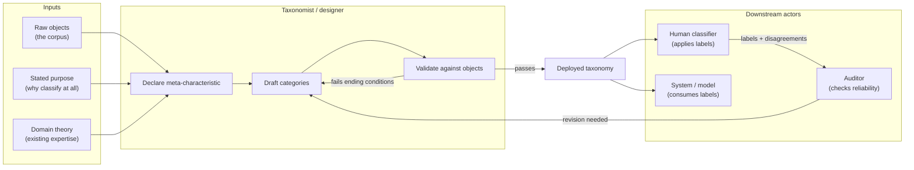
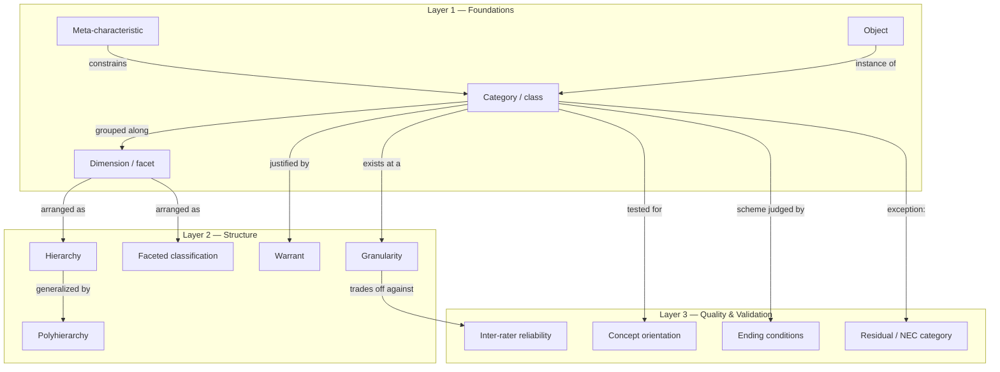
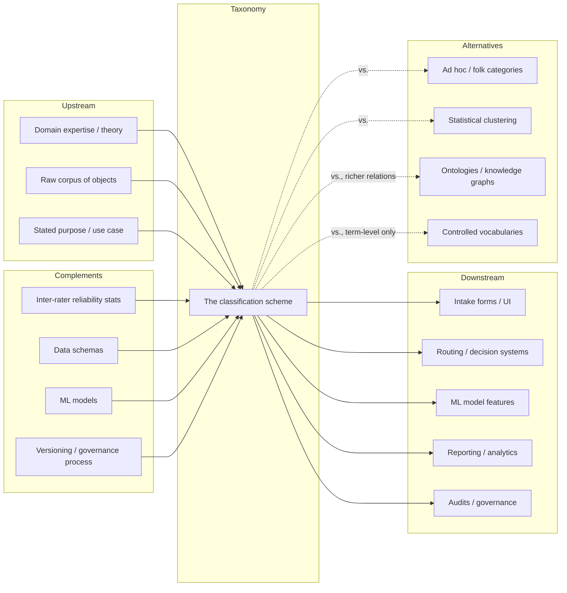

# Learning Map: Taxonomy

*A mental model and world model for the discipline of classification — not a how-to for building any single taxonomy.*

---

## 1. Essence

**What is it fundamentally?**
Taxonomy is the discipline of imposing a purpose-driven structure on a set of objects by grouping them according to shared, chosen properties. It is not "the categories" — it is the *method* by which categories are declared, justified, tested, and maintained.

**Why does it exist?**
No mind or system can reason about, store, retrieve, or act on an unbounded set of unique particulars. Classification is a compression mechanism: it trades the full information content of every individual object for a smaller, communicable, reusable set of groups — in exchange for the ability to infer, predict, route, and compare.

**What problem does it solve?**
The gap between *infinite particulars* and *finite, actionable categories*. Without it: every object must be handled as a unique case, nothing learned from one case transfers to the next, and no two people (or systems) can reliably mean the same thing by the same word.

**What did people do before it (before it was formalized as a discipline)?**
Folk classification — ad hoc, memory-based, tacit groupings with no declared principle of division, no reproducibility, no audit trail, and no way to tell whether two people classifying the same object would agree.

**What new possibilities does it create?**
- **Prediction** — knowing an object's category lets you infer properties you haven't observed directly.
- **Routing/automation** — a system can act differently based on category without inspecting every object individually.
- **Comparability** — independent systems using the same taxonomy can be compared or merged.
- **Scientific inference** — a good taxonomy can reveal real structure in a domain (the way the periodic table predicted undiscovered elements).
- **Inheritance** — in hierarchical schemes, a subclass inherits and specializes the properties of its parent.

---

## 2. World Model

**Objects** — the instances being classified, plus the categories, dimensions/facets, and relations (is-a, part-of, has-a) used to describe them.

**Actors** — the taxonomist (designs and revises), the classifier (applies the labels — human or automated), the auditor (checks reliability and drift), and downstream systems (route, report, or learn from the labels).

**State changes** — unclassified → classified; draft → validated (tested against real objects and real raters); one version → the next (revision, with old meanings either preserved or explicitly retired, never silently changed).

**Workflows** — two development directions, usually alternated: *empirical-to-conceptual* (induce categories from observed objects) and *conceptual-to-empirical* (derive categories from theory, then test against objects). Validation typically follows a consensus cycle: independent labeling → compare → adjudicate disagreements → write guidelines → re-test.

**Systems** — a taxonomy rarely stands alone; it's embedded in intake forms, databases, ML feature sets, reporting pipelines, or governance frameworks.

**Value** — realized entirely downstream: shared vocabulary (communication), routing/prediction (operational), auditability (governance), and — when the categories track real domain structure — scientific insight.

---

## 3. Concept Map

| Layer | Entity | Action | Purpose | Key relationships |
|---|---|---|---|---|
| 1 | Meta-characteristic | Declared once, up front | Ties every category back to *why* the taxonomy exists | Constrains all categories |
| 1 | Category | Assigned to objects | The unit people actually use | Instance of a dimension |
| 2 | Facet | Applied independently of other facets | Lets two audiences use the same object set without forcing one hierarchy | Orthogonal to other facets |
| 2 | Warrant | Cited per category | Answers "why is this category allowed to exist" | Literary (from real cases) / user (from how it will be applied) / theoretical (from accepted domain theory) |
| 2 | Granularity | Chosen level of detail | Balances specificity against reliability | Finer granularity → lower reliability |
| 3 | Concept orientation | Tested per category | Checks a category means exactly one thing | Nonvague + nonambiguous + nonredundant |
| 3 | Ending conditions | Checked against the whole scheme | Tells you when to stop revising | Concise, robust, comprehensive, extendible, explanatory |
| 3 | Residual (NEC) | Explicitly retained, small, justified | Prevents forced mis-fits elsewhere | Should stay small and anchored, not silent |

---

## 4. Decision Map

| Situation | Decision | Reason | Expected outcome |
|---|---|---|---|
| You have real objects but no existing theory of the domain | Build empirical-to-conceptual, from the data up | A theory imposed without contact with reality won't fit the actual objects | A grounded scheme, possibly with messier boundaries than a theory-first design |
| The same objects are used by two audiences with conflicting grouping needs (e.g. a human intake form vs. a downstream model) | Split into two independent facets rather than one compromise hierarchy | One hierarchy can't satisfy contradictory grouping rules without becoming incoherent | Two clean, consistent views of the same objects, usable independently |
| One category keeps absorbing unrelated things | Apply the concept-orientation test: does this category mean exactly one thing? | Categories that silently mean two or three things are the ones raters disagree on | Either redefine the category by a single principle, or split it |
| Two raters disagree a lot on the same objects | Measure and report reliability (κ) at more than one grain size | Agreement is a function of *how fine* the categories are, not a fixed property of the scheme | You learn where to display coarse (reliable) vs. where to keep fine detail (for later use) |
| A finished taxonomy needs to absorb new cases later | Design in multiple granularities and a versioning convention from the start | A rigid, single-level scheme breaks — or gets silently redefined — under new cases | The scheme extends without invalidating historical labels |
| Some objects genuinely don't fit any category | Keep a small, explicitly justified residual category rather than force a bad fit elsewhere | Forcing a bad fit degrades every other category's reliability more than an honest residual does | The residual stays small, auditable, and doesn't quietly become a dumping ground |
| The taxonomy needs to predict something downstream (e.g. routing, difficulty) | Test whether the category is a *type* (a content-independent relation) or *content* (a topical description) | Only type-level structure reliably predicts operational/downstream behavior | You correctly scope which facet is allowed to carry predictive weight |

---

## 5. Search Space Expansion

**Beginner questions rarely asked**
- Is my taxonomy *falsifiable* — could two people disagree in a way that would actually prove it's badly designed, or does it just absorb any outcome as "fine"?
- Isn't a taxonomy just a database schema with extra steps?

**Questions experts ask**
- What's my meta-characteristic, and would I choose the same one if the *audience* changed?
- Is this category monothetic (a checkable rule) or polythetic (a family resemblance with no clean necessary-and-sufficient definition) — and does my validation process match which one it actually is?
- What's the warrant for this specific category: did it come from real cases (literary), from how people will actually use it (user), or from an accepted theory of the domain (theoretical)? Categories with none of the three are the weakest.

**Questions worth exploring next**
- If I added a second, independent facet, would my awkward "mixed" categories disappear on their own?
- If I rename a category two years from now, does the old data still mean what it used to — or have I silently redefined history?
- Where does my "other/NEC" bucket actually route to downstream — and is its share growing quietly over time?

**Questions that define mastery**
- Can I predict, *before* testing, which of my categories will have the worst inter-rater reliability, and explain why in advance?
- Can I tell the difference between a *classification* failure (the categories are badly designed), a *labeling* failure (the raters weren't trained or didn't agree on a rule), and a *domain* failure (the world genuinely doesn't have clean boundaries here, and no taxonomy will fix that)?
- Do I know which parts of my scheme are permanent/definitional and which are contingent on current practice or tooling — and therefore need a version number, not just a stable name?

---

## 6. Ecosystem

**Upstream** — domain expertise the taxonomy formalizes; the raw corpus of real objects; the stated purpose that determines the meta-characteristic.

**Downstream** — intake forms, routing/decision systems, ML model features, reporting/analytics, audits, and other taxonomies built by extending or reusing this one.

**Alternatives** — ad hoc categorization (no formal process, no reproducibility); pure statistical clustering (data-driven but not necessarily human-interpretable or purpose-aligned); ontologies/knowledge graphs (richer relational structure, heavier formalism); controlled vocabularies/thesauri (term-level standardization, less structural ambition).

**Complements** — reliability statistics (validate it), data schemas (implement it), ML models (consume it), and a governance/versioning process (keeps it alive over time rather than freezing it at v1).

---

## 7. Transferable Principles

| Category | Content |
|---|---|
| **First principles** | A category is defined by a meta-characteristic tied to purpose. Classification is never objectively "true" — only fit or unfit for a stated purpose. Structure that predicts one thing (e.g. topic) does not automatically predict a different thing (e.g. processing difficulty). |
| **Transferable methodologies** | Alternating empirical-to-conceptual and conceptual-to-empirical development; consensus-based validation (independent coding → compare → adjudicate → guideline); reporting reliability at multiple granularities, not one number; faceted design when audiences genuinely differ; a small, explicitly justified residual category. |
| **Implementation details** *(low transfer)* | The specific category names in one dataset; the specific software storing the labels; the specific reliability threshold considered "good enough" in one field vs. another. |
| **Stable knowledge** | Concept orientation, warrant, ending conditions, monothetic vs. polythetic — these are durable classification-theory concepts, unlikely to be revised by new tools. |
| **Changing knowledge** | Which automated methods currently achieve which reliability on which task; which fields are "worth" adding as a domain or technology shifts; current benchmark numbers for any specific instrument. |

---

## 8. Minimum Mental Model

If you remember nothing else about taxonomy, remember these fifteen:

1. **Meta-characteristic** — the one principle every category must trace back to.
2. **Category / class** — the actual unit people apply.
3. **Concept orientation** — one category, one meaning: nonvague, nonambiguous, nonredundant.
4. **Warrant** — literary (real cases), user (how it's applied), or theoretical (accepted domain model).
5. **Monothetic vs. polythetic** — a checkable rule vs. a family resemblance.
6. **Hierarchy vs. facet** — one tree vs. independent, simultaneous dimensions.
7. **Polyhierarchy** — letting one object belong to more than one branch at once.
8. **Granularity** — the level of detail, and its direct trade-off against reliability.
9. **Ending conditions** — concise, robust, comprehensive, extendible, explanatory.
10. **Residual / NEC category** — small and justified is fine; large and silent is not.
11. **Inter-rater reliability (κ)** — the real measure of whether a scheme is usable, not a nice-to-have.
12. **Empirical-to-conceptual / conceptual-to-empirical** — the two directions of development.
13. **Type vs. content** — whether a category predicts *operation* or only describes *topic*.
14. **Graceful evolution / concept permanence** — change is fine; silent redefinition is not.
15. **Multiple consistent views** — the same objects, correctly classified two different ways for two different audiences.

---

## 9. Common Misconceptions

| Misconception | Why it happens | Better mental model |
|---|---|---|
| More categories = more precision = a better taxonomy | More detail feels like more information | More categories almost always means lower inter-rater reliability and sparser cells; precision without reliability is noise, not information |
| Naming the categories makes the classification objective | It feels like discovery, not choice | Every taxonomy encodes a purpose-driven decision (the meta-characteristic); a different purpose would legitimately produce different categories from the *same* objects |
| A taxonomy is a static output — once built, it's done | It's delivered as a finished document or table | A taxonomy is a maintained artifact with a lifecycle: versioning, residual monitoring, drift, and periodic re-validation are ongoing costs, not one-time work |
| Good categories automatically predict good downstream outcomes (routing, ML performance) | It feels like the categories "contain" the relevant information | Content (what it's about) and type/structure (what operation it needs) are different axes; only the structural axis reliably predicts operational outcomes |
| Inter-rater disagreement means the taxonomy is wrong | Disagreement looks like failure | Some disagreement is intrinsic to real-world, polythetic categories; the fix is usually a documented tie-break rule, not eliminating all ambiguity |
| A residual "other" category signals an incomplete taxonomy | It looks like unfinished work | A small, explicitly justified residual is an accepted, even recommended feature; the actual danger is an unbounded, *unexplained* one, not a small bounded one |

---

## 10. Summary

> What I truly gain is not **a set of labels**, but **a reusable, falsifiable theory of which distinctions in a domain actually matter — to whom, for what purpose, and with what evidence that the distinction holds up when tested.**
