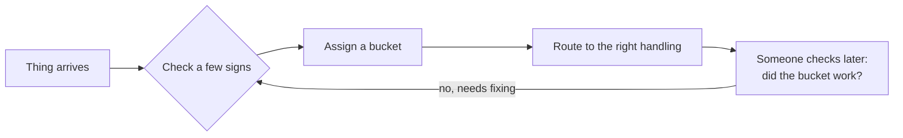

# Taxonomy — the short version

*Think of it as: hospital triage, but for anything.*

---

## 1. What is it, really?

When a patient walks into the ER, nobody has time to fully diagnose them on the spot. So instead, a nurse checks a few quick signs and sorts them into a bucket — **red** (now), **yellow** (soon), **green** (wait) — and that bucket decides what happens next.

**Taxonomy is that sorting system, generalized.** It's not about the patients (or documents, or requests, or anything else) — it's about the *rules for putting things into a small number of buckets*, so you can act on them without examining every single case from scratch.

---

## 2. Who's involved, and what happens

- Someone **designs** the buckets (like a hospital deciding what counts as "red").
- Someone **applies** them (the triage nurse, or whoever's sorting).
- Someone **checks** later whether the sorting actually worked (an audit — did two nurses agree on the same patient?).

---

## 3. The basic pieces (plain terms)

| Jargon | What it actually means |
|---|---|
| Meta-characteristic | *Why* you're sorting at all. Triage sorts by "how urgently do they need care" — not by, say, hair colour. Pick the wrong "why" and the buckets won't be useful. |
| Category | One bucket — "yellow." |
| Concept orientation | Does "yellow" mean *one clear thing*, or does it secretly cover three different situations nurses interpret differently? A good bucket means one thing. |
| Residual / "other" | The rare patient who doesn't fit red, yellow, or green cleanly. Fine to have a small "unclear — needs a second look" bucket. Bad if it quietly becomes 40% of patients. |

---

## 4. A few real decisions

| Situation | What to do | Why | What you get |
|---|---|---|---|
| You have real patients but no rulebook yet | Build the rules by watching real cases first, not by guessing in an office | A rulebook written away from the ER floor won't match what actually walks in | Buckets that fit reality |
| Two nurses keep disagreeing on the same patient | Measure how often they agree, don't just assume the rules are fine | If trained staff can't agree, nobody downstream will either | You learn if the buckets are too vague, or too fine-grained |
| One bucket keeps absorbing totally different cases | Ask: does this bucket mean one thing? | A bucket meaning three things is the one everyone argues about | Split it, or redefine it |
| You need more buckets later | Design so new buckets can be added without renaming old ones | Otherwise, old records stop meaning what they used to | The system grows without breaking history |

---

## 5. Questions worth asking

- If I gave the *same* patient to two different nurses, would they pick the same bucket?
- Is my "yellow" actually one thing, or is it quietly doing the job of two buckets?
- Where do the "unclear" cases actually go — and is that pile growing without anyone noticing?

---

## 6. Where it fits

**Upstream:** medical knowledge decided which vital signs actually predict urgency — the sorting system didn't invent that, it just organizes it.
**Downstream:** the bucket decides which ward, which doctor, how fast — real consequences, not just a label.
**The alternative:** no system at all — every patient handled purely on one doctor's gut feeling, which doesn't scale and can't be checked or compared.

---

## 7. What travels, what doesn't

- **Travels anywhere:** "sort by a clear reason, test whether trained people agree, keep a small honest 'unclear' pile" — this works for triage, for sorting emails, for anything.
- **Doesn't travel:** the specific colours, the specific cutoffs — that's local to one hospital, one moment in time, and can change.

---

## 8. If you remember five things

1. Sort for a *reason* (the "why") — not arbitrarily.
2. A good bucket means **one** thing, not two or three stitched together.
3. Test whether people actually agree when using your buckets — don't assume.
4. Fewer, broader buckets are usually more reliable than many narrow ones.
5. A small "unclear" pile is fine. A silently growing one is not.

---

## 9. Common mix-ups

- **"More buckets = more precise = better."** Usually backwards — more buckets means people agree *less* on which one to use.
- **"If two people disagree, the system is broken."** Not always — real cases are messy; a clear tie-break rule usually beats trying to force zero disagreement.
- **"An 'other' bucket means the system is unfinished."** No — it means the designers were honest about the edge cases, instead of jamming them somewhere they don't belong.

---

## 10. In one line

> Taxonomy isn't the list of buckets — it's the *tested reason* the buckets exist, and the proof that two different people sorting the same thing would land in the same place.
